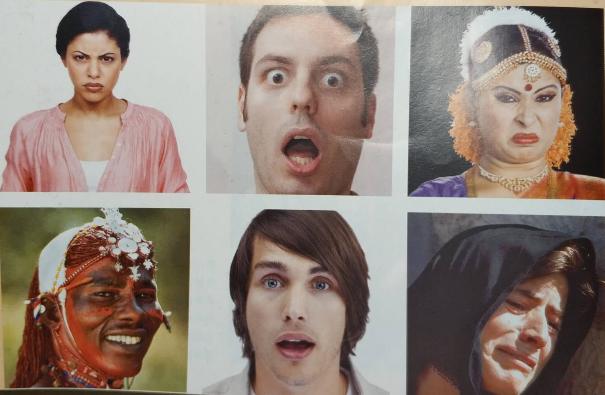

解释别人的行为是我们每个人都有的一项基本爱好。

我们看电影、读小说、跟别人交往，都是时时刻刻尝试着解释别人的行为。

他们是什么样的人？他们为什么是这样的人？他们为什么要这样做？这些问题令我们着迷。

但要理解他人并不容易。

因为，人类行为的原因，通常不是我们能够看得到的。我们所能掌握的只有可观察的行为，例如别人做了什么事、说了什么话，以及他们的面部表情、姿势和说话的语调等。

单凭可观察的行为，并不能准确推断一个人以及他的行为。

这一章就是有关“社会知觉”的研究，即有关我们如何形成对他人的印象，及如何对他们的行为原因作出推论的研究。

## 非语言沟通

我们理解他人的一个重要的信息来源是人们的非语言行为，比如他们的面部表情、身体动作和说话的语调等。

我们先看一下这幅图，你能不能准确地说出这些面部表情代表的含义？

（该图片来自阿伦森等的《社会心理学》一书）

非常简单，是吧？

因为这六种表情是人类最基本的情绪表达，在我们婴儿时期已经能够分辨。可以说分辨它们是我们与生俱来的能力。

它们分别是（从左到右，从上到下）：愤怒、恐惧、厌恶、快乐、惊讶、悲伤。

这六种情绪是人类共通的，不分种族、不分地区、不分语言、不分文化，都可以被识别。它们是非文化经验的产物，说明这六种情绪表达在人类很原始的状态下已经形成，甚至可以追溯到动物时期。

人类除了这六种基本的、共通的情绪表达外，还有很多种其它情绪表达。有些是跨文化的，有些是文化特有的。

《美国国家科学院院刊》的一项最新研究发现，人类的情绪大约有27种。他们包括：钦佩、崇拜、欣赏、娱乐、焦虑、敬畏、尴尬、厌倦、冷静、困惑、渴望、厌恶、痛苦、着迷、嫉妒、兴奋、恐惧、痛恨、有趣、快乐、怀旧、浪漫、悲伤、满意、性欲、同情和满足。

除了面部表情，还有身体动作和说话的语调，都可以反映一个人的行为特征，完成一部分沟通交流的目的。

许多非语言沟通的方式，是特属于某些文化的。一个文化中的某些非语言行为在另一个文化中毫无意义，不仅如此，同样的非语言行为虽然同时存在于两个文化中，但意义却大相径庭。来自不同社会的人互相交流时，这样的非语言差异可能造成误会。

比如目光接触与注视。在美国文化中，直接的目光接触是受到肯定的，一个人如果不肯直视对方的眼睛，会被认为是在逃避甚至撒谎。不过在世界上，许多地方直接的目光接触，却被认为是不礼貌的，在面对地位较高的人时更是如此。

又比如个人空间与身体接触。社会类型是形形色色的，有些社会属于接触率高的文化，这些地方的人彼此站得很靠近，也经常触碰对方；有些社会则属于接触率低的文化，这些地方的人保持较大的人际空间，较少彼此接触。

这一点到世界各地旅行的人应该深有感触，不同地区文化的人在行为模式上差别很大。如果对地方文化不了解，就有可能产生误会。所以，在旅行之前，很多人都会提前了解当地的文化风俗，就是为了能够更好地沟通交流。

## 内隐人格理论

我们之前提到过：“图式”是一种心理捷径。面对不确定的场景，如果我们掌握的信息很少，“图式”就提供额外的信息来填补空白。

当我们尝试了解他人时，把对这个人仅有的一点观察了解作为起始点，然后运用我们的心理图式来进行更完整充分的理解。这一类“图示”就叫做“内隐人格理论”。

比如我们常用两种普遍的图式来快速形成关于某人的印象。

第一种图式涉及“热情”的判断：一个善良而热心的人通常被认为是慷慨大方、值得信赖且乐于助人的；一个冷酷的人则相反。

第二种图式涉及“能力”的判断：一个有能力且有干劲的人，被认为是强大而有控制力的；而无能者则相反。

内隐人格理论受文化差异的影响很大，一个文化中的内隐人格理论，可能会和另一个文化中的迥然不同。

例如，在西方文化中说某人具有艺术人格，意味着这个人很有创造性、性格热烈、神经敏感，而且生活狂放不羁。然而中国人却没有关于“艺术类型”的图式或内隐人格理论。

相反，在中国，也有在西方文化中根本不存在的人格类型。例如“世故”的人格类型。一个人“世故”就是指这个人在尘世中摸爬滚打、精于处世之道、顾念其家人、具有很强的社交能力，而且沉默自制。

内因人格理论对我的启示什么？

人类固有的心理图式根深蒂固，比如看到漂亮的人就心生欢喜，同时认为他有美好的品德；看到难看的人就心生厌恶，同时认为他有不好的品质。

漂亮的人就一定善良吗？难看的人就一定卑劣吗？经历过世事的人都会明白：美丽的外表下可能藏着蛇蝎心肠，丑陋的面容后可能怀着慈悲之心。

就像小说《弗兰肯斯坦》里那个所谓的“怪物”，因为长得丑就被所有人排斥和敌视，就连他的造物主弗兰肯斯坦先生都嫌弃他而欲除之而后快。即使他对人类表现出很大的诚意，主动帮助人类，人类还是会恐惧它、仇视他。最终把他推向了极端，酿成了不可挽回的悲剧。

一定不要被表面所迷惑，而丢掉了永恒的内在。

## 归因理论

我们已经看到，在观察别人时，我们拥有丰富的信息来源（对方的非语言行为），并以此为基础形成我们的印象。从非语言行为，我们也能猜测出对方的人格特质，例如有多友善或多外向。我们一旦得到这些信息，接着就可以利用我们的内隐人格理论来填补空白：例如这个人很友善，那么他应该也很诚恳。

但是，表象是会骗人的。

例如你遇见一个熟人，他对你说：“真高兴见到你！” 

他真的是这么想的吗？

也许，他只是出于礼貌；又或许，他根本就是在撒谎，他其实很讨厌你。

那位熟人的表现为什么会是那样？

为了回答这个“为什么”的问题，我们会观察人们的行为和动机，形成更宏观、更复杂的推论。这就是所谓的“归因理论”。

归因理论是对我们如何从他人的行为中推论原因的研究。

一种最简单且流行的归因理论是由弗里茨·海德提出的二分法：内部归因和外部归因。

内部归因认为他人行为的原因，跟他自己有关（他的人格、态度和个性），也就是从自身角度解释他的行为起因。

外部归因认为他人的行为原因是当时的情境引起的，跟他的人格、态度和个性关系不大。

这种简单的归因方式，在现实生活中会有深刻的体现。

比如在婚姻中，婚姻美满的夫妻倾向于对伴侣的正面行为做内部归因（“他之所以帮助我是因为他是一个非常慷慨的人”），而对伴侣的负面行为做外部归因（“他之所以说这些刻薄的话，是因为他这周的工作实在太紧张了”）。

相反，婚姻不幸的夫妻倾向于出现相反的模式：认为其伴侣的正面行为是由外部原因所致（“他之所以帮助我，是因为他想给我的朋友留下好的印象”），而负面行为则是由内部原因引起的（“他之所以说这些刻薄的话，是因为他根本就是一个自以为是的混蛋”）。

显然，在婚姻这件事情上，归因二分法加剧了事态的演变：让好的更好，让坏的更坏。

## 归因理论的共变模式

上面提到的弗里茨海德的归因二分法，虽然简洁明快，但在现实中该模型太过于简单了。

哈罗德·凯利发展了归因理论，提出了共变模式。他认为当我们形成对他人的印象时，我们会注意并思考不止一项信息。我们会检视观察对象不同时间、不同情境下的各种行为案例，综合这些信息来推论原因。

主要是三类信息：共识性信息、特殊性信息和一致性信息。

共识性信息是指，其他人对相同的刺激曾做出什么行为。

特殊性信息是指，行为者对其他刺激的反应如何。

一致性信息是指，在不同时间和不同的环境下，被观察的行为出现在同一个行为者和同一个刺激之间的频率。

我们用一个例子来解释一下这三类信息以及是如何发挥作用的。

假设有一天你在公司里看到你们老板对你们部门的一名员工（比如小张）大发脾气。

你自然地想知道：“老板为什么对他发火？”这个原因你自然不敢去问老板；如果你跟小张不是很熟，你估计也不能去问他。

那怎么办？你尝试使用归因理论的共变模式来推论原因。

共识性信息：其他人是否也经常对小张不满，甚至批评他？如果是，说明共识性高；如果不是，说明共识性低。

特殊性信息：老板是不是也经常对其他员工发脾气？如果是，说明特殊性低；如果不是，说明特殊性高。

一致性信息：老板是不是经常对小张发脾气？如果是，说明一致性高；如果不是，说明一致性低。

有了这些信息，就可以开始归因了：

第一种：当共识性低（没有人其他人会批评小张）、特殊性低（老板对其他员工也经常发火）、一致性高（老板经常对小张发火）时，我们倾向于对老板做内部归因——这个老板就这个德行，他就是一个苛刻、爱发火的人。

第二种：当共识性高（其他人也经常批评小张）、特殊性高（老板不经常对其他员工发火）、一致性高（老板经常对小张发火）时，我们倾向于对老板做外部归因——这件事情跟老板无关，应该怨小张。

第三种：一致性低（这是老板第一次对小张发火），那么不管共识性和特殊性高或低，我们都无法清楚地做内部或外部归因。这时我们倾向于做情境归因，即老板可能是刚刚听到了一个坏消息，而小张刚好撞到了枪口上。

共变模式假定人们以理性逻辑的方式来做因果归因，有系统、有逻辑的推论行为的起因。然而，人们在对他人的行为形成判断时，并不一定会保持逻辑性和理性。有时候人们会曲解信息，以满足自己高度的自尊需求。

## 基本归因错误

关于人类行为，我们大多数人都抱有一个普遍的、基本的图式，那就是：人们的所作所为起因于他们是什么样的人，而非他们处于什么样的情境。

这种高估人们行为内部的、性格的因素，而低估情境因素的倾向被称为“基本归因错误”，也称为“一致性偏见”。

这并不是说做内部归因都是错误的，很明显，人们常因他们性格原因做出某些行为。然而，有相当多的证据显示社会情境对行为有强大的影响力。

那么，为什么人们会犯基本归因错误呢？

原因之一是，在我们尝试解释他人的行为时，我们的注意焦点常放在人身上，而非周遭的情境。

事实上，关于行为原因的情境信息，通常是我们无法获知或难以正确解释的。

比如，今天我们上班，发现同事小张很让人恼火，说话尖酸刻薄，一副别人欠他钱的嘴脸。

你会怎么解释小张今天的行为呢？

如果你跟小张平时不熟，并不知道他一贯的为人表现，你多半会把这些行为归因于他这个人：小张是一个刻薄、冷漠、难以相处的人。

但是，真实的小张可能根本不是这样，他今天种种行为的真实原因你也根本无从知晓。

早上，小张出门前因为家庭琐事跟老婆闹了别扭；在路上因为堵车又跟人吵了一架；带着一肚子气来到公司，谁知道上午又被领导叫过去批了一顿，说他的方案写的一团糟，必须重写。小张今天的心情低落到极点，不满写满了脸上。刚好你找上他，于是发生了那些让你恼火的行为。

你并不知道之前在小张身上发生了什么事，即使听说了一些，你也不知道小张对这些事情作何反应。这些情境信息，对你是无法获知或难以正确解释的。

人具有极高的“知觉显著性”：我们极其重视眼睛和耳朵所注意到的事物。

你眼里看到的就是小张这个人和他的行为表现，你所注意到的，似乎就是被观察行为合理的、符合逻辑性的原因。

你看不到情境信息，所以忽视了它们的重要性。

现在，你还会觉得小张是一个刻薄、冷漠、难以相处的人吗？

## 归因的两阶段过程

我们前面说了产生基本归因错误的第一个原因：人的“知觉显著性”。现在我们说一下产生基本归因错误的第二个原因：归因的两阶段过程。

人们在做归因时会经历一个两阶段过程。首先，我们先做内部归因，假设他人的行为的起因源于个人因素。其次，我们再试着调整这个归因，将他人所处的情境加以考虑。

但是，很多人在做完第一阶段的内部归因之后就会停止，没有做第二阶段的调整。这就是犯下基本归因错误的关键所在。

为什么？因为第一阶段的内部归因会迅速而自发地产生，而第二阶段则需要做出更多的努力和有意识的分析。

我们举个例子来说明一下这个过程。

比如你坐公交车，看见有人问车上的售票员哪一站下车合适，但售票员态度恶劣，很不耐烦地告诉那个人。

你会对这名售票员作何感想？她为什么会这样？

你的第一反应肯定是：这个人怎么这样！太差劲了！人品这样还干这行，真是不负责任！

你不自觉地在做第一阶段的内部归因，这个过程是非常自然、迅速地发生的，你可能根本就没有意识到这些想法就已经出现在你的脑海中。

如果这个时候你比较疲惫，懒得去思考事情，或者你有其它的事情去关注，那么你对这个售票员的归因就终止于此。

如果你有心情而且闲着无事，你的思维可能会往前推进一步：这个售票员平时会这样吗？她下了班生活中会这样吗？她是不是不喜欢这个岗位觉得枯燥乏味才这样的 ？她是不是今天家里有什么事才这样的？也许她平时并不是一个刻薄冷漠的人吧？

这就是进入了第二阶段的情境归因，这个过程是有意识的分析过程，需要你付出一定的思维能量。

虽然经过第二阶段的分析，你仍然不能知道这个售票员行为的确切原因。但你起码不会把她行为的原因全部归因于她这个人，而是或多或少理解一下她。这就是所谓的“共情”能力吧。

基本归因错误是一种心理图式，想完全避免是不能的。我们能做的就是一点一点改善自己的思维，使之更理性、更严谨。

对于初次接触的人，不要武断地下结论：他就是什么什么样的人！而是尽量熟悉各种情况，结合情境因素，作为综合的评判。

人的自动化思维非常强大，强大到我们意识不到的情况下就已经发生了。所以，这是一个思维训练的过程。如果我能够意识到人类经常犯基本归因错误，能够有意识地去训练自己进行第二阶段的归因分析，久而久之，会形成一种思维习惯。有了这种思维习惯，也许我们就可以少犯一些基本归因错误吧。

## 分析性思维和整体性思维

北美和其他西方文化都主张个人自由。一个人是一个独立的个体；他的行为反映了个人特质、动机和价值观。

相反，东方文化，比如中国、日本、韩国，主张集体优先，个体需要是排在集体需要之后的。

不同的文化价值观影响人们对于外部信息的察觉和注意。

西方文化主张的个人主义，让人们构建了分析型思维方式。这种思维方式让人们更多的注意主体而非背景。

东方文化主张的集体主义，让人们构建了整体性思维方式。这种思维方式使人们关注“整个画面”，即主体和背景，甚至还包括两者之间的关系。

基于这两种不同的思维方式，是不是代表着西方文化中的人比东方文化中的人更容易犯基本归因错误呢？

研究表明的确如此。个人主义文化中的人的确更偏好对他人做出性格归因，相比之下，集体主义文化中的人更偏好做出情境归因。

因此，西方文化中的人看起来更像人格心理学家，从性格角度来看待行为。相反，东方文化中的人看起来更像社会心理学家，会考虑到行为的情境原因。

但是，如果认为集体主义文化中的人从不进行性格归因，则是错误的。他们也会做出性格归因，仅仅是程度问题。最近研究显示，对人们的行为进行性格归因在许多文化中都普遍存在。但集体主义文化人的人会更多的注意到情境是如何影响行为的，并更有可能将情境的影响考虑在内。

可见，任何文化都是有利有弊的，没有完美的文化，也没有一文不值的文化。

就像西方文化注重个体自由，被赋能了创新精神，但容易忽视背景因素，所以更容易犯基本归因错误；东方文化注重整体观念，被赋能了共情能力，但容易忽视个体感受，所以更容易缺乏独立自我。

我们要了解自己文化的利弊，不要一味地吹捧，也不要一味地贬低。同时，也要公平地对待别的文化，有容乃大。

## 自利归因

当人们的自尊受到威胁时，他们通常采取自利归因。简单的说，就是通过内部归因将成功归功于自己，通过外部归因将失败归咎于他人或情境的倾向。

比如一个还算努力的学生完成了期末考试，当他看到自己的成绩时，他会怎么想？如果成绩很好，他往往会认为好成绩出自自己的天分和努力；如果成绩比较差，他往往会认为跟外部因素有关——考试题目太难了，或者考试不公平等。

我们为什么会做自利归因呢？

第一个理由是大多数人会尽可能的维护他们的自尊，即使必须改变想法或者信念，扭曲事实。

第二个理由是我们如何在别人面前表现自己。我们都希望别人知道我们很棒，希望获得别人的尊敬。告诉别人自己不好的表现是由于外在因素的影响，可以给失败的“脸上贴金”。就是所谓的“找借口”。

第三种理由和信息不对称有关。有时候我们并不能清楚的知道所有的信息，以至于不能做出合理的归因。比如上面那个学生没考好，他认为考试是不公平的，老师的考核是不合理的。因为他并不知道其他同学的考试情况和成绩；但老师知道所有同学的成绩，给这位同学这个分数是合理的。

一种特殊的自利归因方式叫防卫归因。

比如生活中最难以理解的事就是悲剧的发生，例如强暴、绝症以及致命的意外。即使悲剧是发生在素未谋面的陌生人身上，这种事也会使我们惊慌。它们提醒我们，如果这样的悲剧能够发生在其他人身上，那么也有可能发生在我们身上。这让我们的生活惶恐不安。因此，我们需要采取某种方法否认这些事实，其中一种方法就是做出防卫归因。

比如我们相信坏事只发生坏人身上，或者至少只会发生在那些做出愚蠢行为或决定的人身上。因此，这种事不太可能发生在我们身上，因为我们不会那么愚蠢或不小心。这就是所谓的“善有善报，恶有恶报”的信念。

这种信念我们认为天经地义，时常挂在嘴边，增加我们对生活的安全感。但我们何曾反思过这种信念的现实性和正确性？世界真的是这样吗？善人就一定有善报？恶人就一定有恶报？会不会反过来呢？这里面会不会有什么陷阱？

最大的陷阱就是：在一个大多数人都倾向于相信世界是一个公平地方的社会中，经济和社会不平等会被看成公平的。在这样的社会中，人们相信穷人和弱势群体之所以所得较少，是因为他们本来就应该所得较少；穷人之所以穷，是因为他们懒、他们笨、他们不上进，所以他们穷是咎由自取。

因此，追求普遍公平的“公平世界信念”反而被用来为不公平进行解释和辩护。

初步研究显示，这的确是事实：在贫富分化极端严重的文化中，公平世界归因比在财富分配比较公允的文化中更为常见。

说明这一信念更多的是一种自欺欺人，并不符合客观现实，实际上发挥着“阿Q精神”的作用。

因为“世界公平信念”导致的极端思维，也很常见，比如“责怪被害人”现象。

所谓“责怪被害人”，即犯罪或事故的受害人常被认为是他们自己造成的不幸，是咎由自取。

比如，我们在报纸上看到一条悲剧：北大的一名女生因为感情问题自杀；我们还浏览了一些细节，说她遇人不淑，她的男朋友对她进行精神控制，导致她精神崩溃而自杀。这是一场悲剧，这个女孩子是这场悲剧的受害者，我们应该同情她，而谴责她的可怕的男朋友。但是，很多人在内心深处会冒出一种声音：“可怜之人必有可恨之处！她自己肯定有问题，不然为什么不控制别人，偏偏能控制她！”

这就是世人的复杂心态：面对犯罪或事故的受害者，同情中夹杂着一股酸溜溜的责备。

我们是好人吗？我们是坏人吗？我们与恶的距离有多远？

恐怕没这么简单！如果这是一种普遍的心理图式，那么一定不是单纯的善与恶所能界定的。

通过使用这种归因偏见，我们就不必认为生活中存在某种随机事件，即意外或犯罪很可能时刻准备着，等着无辜的人，包括我们自己。这种公平世界的信念，使我们不会对自己的安全产生忧虑，它帮助人们保持对世界是安全、有序以及可预测的生活信念。

可见，这种心理偏见对于人类个体而言可能是不公平的，但对于人类整体生存而言，是有利的。它在漫长的进化中保存了下来，依然影响着今天的我们。 