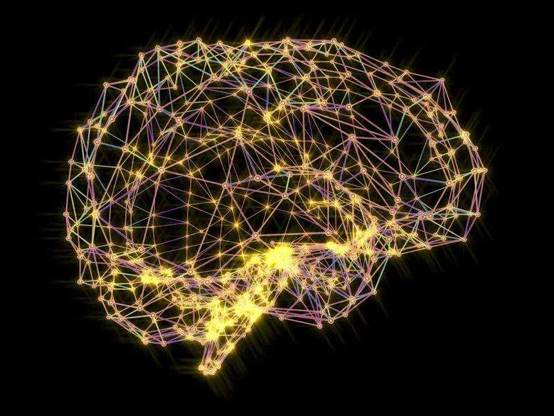
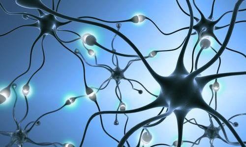
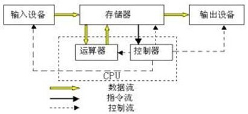
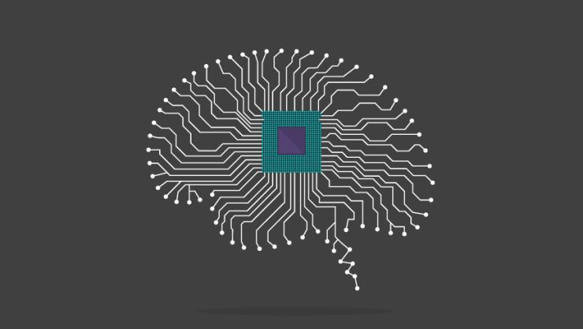
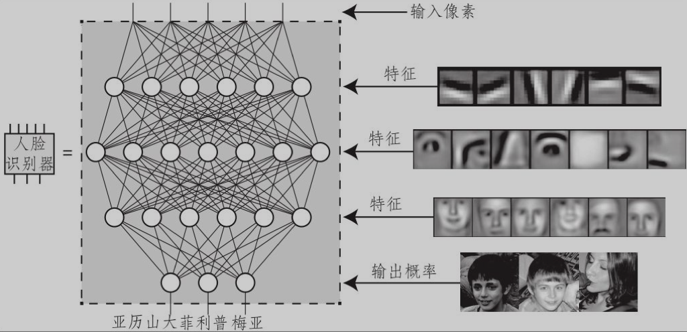
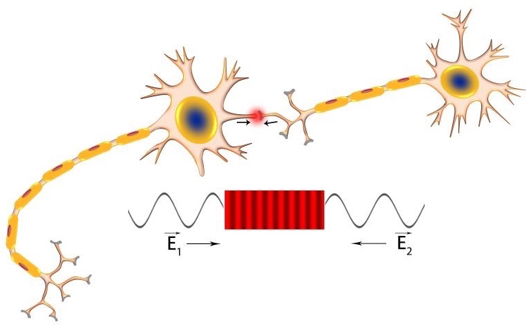

> 学习科学，从本质上来说研究的是“意念肌肉”如何工作，即大脑是如何运作的。

大脑的运作超凡卓绝，无可比拟。虽然科学家们对大脑的运作进行了旷日持久的研究，但它的很多方面对于今天的我们仍然是一个个谜。它就像一个高超的魔法师，利用神经元变幻出令人眼花缭乱的魔法，产生出一个又一个奇迹，让我们惊叹于这大自然最伟大的创造。

人类大脑里的神经元，也就是形成脑灰质的大脑细胞，平均在1000亿个左右。它们相互连接，组成一张张网，交织成一个小宇宙。这个小宇宙中能够储存的信息容量惊人，足够支撑300套电视节目的同时播放。

大脑中差不多有10GB的电子信息，它们详细描述了在任何时刻，在你的1000亿个神经元中有哪些正在放电，还有100TB的化学生物信息，它们详细描述了神经元之间突触连接的强度。

我们的大脑是如何感知这个世界的？这个过程极其复杂，为了简便起见，我们使用一个比喻来理解一下。

逢年过节，小区内通常会张灯结彩。最常见的一类彩灯图案，就是用各种彩灯串起来，组成各种各样的形状，比如动物啊，植物啊，五角星啊。接通电源后，这些彩灯图案就会交替亮起，炫彩夺目。走近看，是一个一个单独的彩灯，看不清楚它们的整体轮廓；走远了看，就会清楚明白地看到一幅幅精彩的图案，而一个个彩灯就会隐藏在整体轮廓下。

大体上，大脑对外界事物的输入呈现的状态就像这些彩灯图案。交错连接的神经元就是那些彩灯，一组神经元同时亮起就代表了一个事物的状态。当然，神经元的连接状态比这些彩灯要复杂的不知高多少个数量级，所以，它们能呈现的事物的复杂性和数量也是难以比拟的。

这只是我们的大脑最基本的一个功能——对外界事物的感知。接下来对这些感知的信息如何处理？如何储存？如何提取？如何遗忘？如何回想？如何加强？一连串的程序交错运行，有条不紊，共同组成了这个世界上最强悍最神奇的超级计算机。

我们的大脑有两套记忆构筑系统，一个是显意识记忆系统，一个是潜意识记忆系统。显意识的记忆系统通常用于对显式知识的学习，诸如语言的学习、科学知识的学习等。潜意识记忆系统通常用于对隐式知识的学习，诸如身体技能、运动技能等。我们可以复习、写下今天在历史课或几何课上学到的东西，可是却不能用同样的方式，复习足球场上体操房里面的训练，或是其他任何类似的动作学习。
大脑对显式知识的学习过程，类似于计算机的运作过程。当然，这是一个简单的类比，大脑的运作过程比目前最先进的计算机也都要复杂的多。我们只是利用计算机模型来方便地理解大脑的运作而已。

从抽象层面来看，计算机的硬件组成有以下几个模块：输入设备、输出设备、数据总线、中央处理器（CPU）、存储设备。输入设备有键盘、鼠标、麦克风、摄像头等，负责数据的输入；输出设备有显示器、扬声器等，负责数据的输出；数据总线负责数据的传输；中央处理器包括计算器和控制器，负责数据的处理；存储设备包括内存、硬盘等，负责数据的存储。基于硬件之上的是各种编制好的计算机程序，用于完成各种不同的任务。

对大脑做一个类似的抽象，五官四肢是大脑的输入设备和输出设备，全身的神经网络是大脑的数据总线，位于大脑左半球的所谓“解释器”是大脑的中央处理器（科学家至今还无法精确定位它的位置），海马体是大脑的内存，遍布外围的新皮层是大脑的硬盘。运行于之上的是各种处理算法——视觉处理模块、听觉处理模块、语言处理模块、运动处理模块、空间方位处理模块、等等，它们共同协作，完成了外部信息的输入、传输、处理、储存、提取和输出。这就是一台精密的计算机，比我们目前使用的任何一台计算机都要精密千万倍。

大脑和计算机相比，最大的不同之处，在于它的记忆原理与计算机的信息存储原理截然不同，这不仅体现在它的构成上，还体现在它的使用方式上，你在计算机或磁盘上读取记忆的方式是通过它存储的位置，但你从大脑中读取记忆的方式则是依据它存储的内容。

计算机的信息存储原理是基于bit位的编码和存储设备上的地址编码，存储和提取都是基于精确的位置索引信息，就像我们在图书馆书架上找一本书时的情形。但从大脑中提取信息的方式更像搜索引擎，不是基于位置，而是基于联想。这种记忆系统被称为自联想，因为它是通过联想而不是地址来进行回想的。这就像某种分子式的书签，被夹在我们的神经网络中，我们不需要一级一级的索引查找，而是瞬间抵达。

我们的记忆就好像是已经存档的一个个视频快照，脑神经一个点击就能启动播放，再一个点击，则又放了回去。在充满奥妙的宇宙世界里，这一定称得上最为奇妙的事情之一。

大脑记忆的这种神奇性，可能要归功于它的物理基础——生物形态的神经网络。正是这种进化亿万年而形成由神经元而组成的神经网络，完成了我们的记忆、计算和学习。

那么，生物形态的神经网络是如何完成记忆、计算和学习的呢？到目前为止还没有确定的答案，科学家们还在进行着持续的研究，只是有了一些阶段性的成果。而这些研究跟计算机科学的结合，也催生了目前最前沿最具划时代意义的学科——人工智能中的机器学习分支。

人工智能的研究者们正是基于模拟大脑而构建了类似生物神经网络的人工神经网络，来进行机器学习的研究。机器学习的研究对象是能从经验中自我改善的算法。

上图就是一个简单的人工神经网络的例子——人脸识别器。在这里，每个点代表神经元，连接每个点的线代表了神经元之间的突触连接。这个人工神经网络经过训练后，当输入一组数字代表图像中像素的亮度时，就能输出一组数字，代表这张图像描述某个人的概率。

对人工智能机器学习的研究，让人着迷，这得益于脑科学和认知科学的研究成果，反过来，机器学习的研究也能促进和启发脑科学和认知科学的相关研究。我们对它们的前景拭目以待。

我们的大脑除了对记忆可以瞬间提取之外，还有一个神奇的特性，那就是可以用记忆来改变记忆。大脑中的信息每提取一次，原有的记忆图式就会发生一些变化，记忆提取的轨迹就会略有不同。换句话说，大脑并不会像电脑那样，把数据、想法、体验等先存储起来，等我们点击文件名时，每次都显示出完全一样的画面来。大脑的做法固然是把它的感知、想法和各种体验都放进记忆网络中，可是，每当这些记忆往外冒时，“泡泡”的组合总会略有不同。这就是所谓的用“用记忆来改变记忆”。

1949年加拿大心理学家唐纳德·赫布在提出了著名的赫布定律：如果两个临近的神经元被同时激活（放电），他们之间的突触连接就会被强化，这样，它们就学会了触发彼此。这个思想可以被总结为一句流行语“一起放电，一起连接”。

赫布定律可以部分地作为“记忆改变记忆”的解释原理。正是因为我们对记忆片段的每一次提取，都会激活相关的神经元，从而强化了神经元之间的突触连接，无形中就重塑了这段记忆。

在赫布学习规则之下，用极其简单的神经网络也能存储许多复杂的记忆，只需要一次又一次的在神经网络上“暴露”相关信息即可。对人工神经网络或者学习技能的动物或人类来说，这种“暴露”信息的情形，通常被称为训练，有时也被称为学习、教育或者体验。

（待续）
