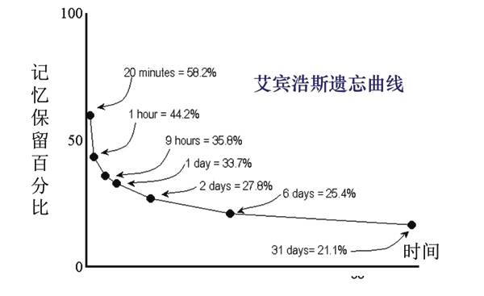

先看一段[视频](https://v.qq.com/x/page/m037411czc7.html)。

这是《中国诗词大会》第2季的飞花令决赛——武亦姝和王子龙的巅峰对决，让我们大呼过瘾的同时，也忍不住发出下面的感慨：

“乖乖，这记忆力，真是惊人! 打死我也记不住啊！”

“这些参赛的选手肯定都是超人，不然他们怎么可能做得到？他们的大脑恐怕不但比我们常人更大、转得更快，而且肯定跟正常的大脑长得不一样，可以做到过目不忘。”

真的是这样吗？

这就引出来两个问题。

第一个问题：强悍的记忆力是天生的吗？

第二个问题：遗忘，就是坏事吗？

你可以停下来想一想，对这两个问题你是怎么想的？

我们大部分人，更倾向于认为好的记忆力是天生的，记忆力上的差距通常是很难追齐的。而且不言而喻，世界上到处都有“没脑子”的人或让人记忆恍惚的事：左耳朵进右耳朵出的少年，怎么也想不起来放到哪儿的房门钥匙，上学时学习的很多知识都已经还给了老师、忘的一干二净。

我们担心健忘症是不是已经悄然上身，这么忘东忘西是不是脑功能失常了？

遗忘，怎么看都是生活和学习的敌人。

但认知科学的最新发现却让我们大跌眼镜，几乎跟我们的传统认知完全相反。

的确有些人生下来就有某种天赋，其记忆能力和思考速度都非同一般。参加《中国诗词大会》这类比赛的人，的确是那些对博闻强识更在行的人。

可是，大脑就是大脑，所有健全大脑的运作模式都一模一样，只要投入足够多的准备和心血，谁都能显示出这种强悍而神奇的记忆力。

影响记忆力的因素有很多，有先天的，有后天的，大致可以归结为三类：天赋、后天的练习、科学的方法。好的记忆力是这三种因素共同作用的结果，而且后天的因素更加明显和重要。

## 遗忘的价值

首先，遗忘是一种垃圾信息过滤器。

遗忘的正面作用之一，就是大自然中最精致的垃圾信息过滤功能，这一功能使得人的大脑能够专注于某一件事，只让该出现的信息出现于脑海。

正如十九世纪美国心理学家威廉·詹姆斯观察到的那样：“假如我们把一切都记在心里，那么在大多数情况下，我们会差劲的像是什么都没记住一样。”

遗忘在大脑运作中的作用，就是屏蔽掉大脑中的背景噪音，或者说静电干扰，让大脑把该输出的信号输出出来。输出的清晰度与屏蔽的强度息息相关。

美国心理学家罗伯特·比约克说过：“我们以为遗忘是件很糟糕的事，是大脑系统的败笔，但实际上，遗忘往往是学习的良师益友。”

其次，遗忘起到了记忆功能先损耗、后增长的效果。

遗忘的这一特性很像我们的肌肉锻炼，当我们提取储存的信息时，为了能强化“习得”，一定程度的损耗是必不可少的。如果没有一星半点儿的遗忘，对于长远的学习就没有任何好处。这就跟锻炼之后的肌肉一样，先损耗，后增长。

说到遗忘的规律，就不能不提到著名的艾宾浩斯遗忘曲线。

## 艾宾浩斯遗忘曲线

遗忘曲线就是一个展示记忆随着时间的推移而逐渐消弥的曲线图，更准确地说，他标示的是新学到的东西将以什么样的速率被遗忘。

这幅曲线图首次由赫尔曼·艾宾浩斯发表于19世纪80年代末期。

到了1914年，极具影响力的美国教育心理学家爱德华·桑代克，将艾宾浩斯的遗忘曲线命名为一条学习定律，也就是失用定律。他坚持认为，如果已经学到的东西没有机会得到不断的运用，那么必将从记忆中渐渐消退乃至彻底消失，也就是用尽废退。

基于艾宾浩斯的遗忘公式推演出来的这条学习法则的确让人觉得很有道理，它和我们生活中的体验似乎也十分吻合，以至于大多数人都相信学习就是用进废退。

但是，艾宾浩斯的遗忘公式有一个漏洞，当时没有被人们足够的注意和重视——他在记忆测试中所使用的材料全都是没有意义的音节。

艾宾浩斯创造出来的是一整套没有意义的发音，其全部由单音节组成，即前后各一个辅音，中间加了一个元音：RUR、HAL、MEK、BES、SOK、DUS等。最关键的是，这些音节全都没有任何语义。

艾宾浩斯一共创造了2300个这样的“元素”，几乎穷尽了所有可能的无意义音节，至少也是他能想得出来的所有无意义字节了。他把这些音节以随机的方式排列组合成许多的“群”，每一个“群”都有7~36个数量不等的“元素”组成。然后，他每次挑一个“群”出来练习记忆。

大脑里没有地方能放置这些三个字母组成的音节。这些东西不但彼此之间没有任何联系，而且跟任何其他事物也没有关联，他们既不属于任何一种语言结构，也没有任何规律可言，因此，大脑留不住这种实在是没有意义的东西。

艾宾浩斯完全明白这一点，他曾写到：他的遗忘曲线可能不适用于他的“独特学习”之外的任何学习。

来自英国的菲利普·巴拉德，首先抓住了这条线索。巴拉德是一位英文老师兼科学研究员，他通过对自己学生的一系列学习实验，最终发现，随着时间的推移，记忆并非只沿着单一的方向一路消退下去，它还有另一条走向，被巴拉德称为“回想”，这是一种记忆的增长：记忆在最初的几天里会增长，哪怕没有做过任何复习；而记忆的逐渐消弥，平均是从第4天之后才会开始。

为什么有些记忆会在头三天有自动回升的现象？而有些记忆却没有呢？

这是因为针对不同的学习材料，有不同的表现。如果学习材料是那些没有意义的音节，或者大多数情况下是那些随机选择而没有什么关联的单词、短句，那么你的回想能力会低的几乎为零，在一两天之后的考试校验中，的确不会出现自动提升的情形。可是反过来，如果学习材料是图片、照片、绘画、诗歌等充满诗情画意的、画面感强的内容，你的回想能力就会强悍很多，而且这一能力还需要过一小段时间之后才会显现出来。

艾宾浩斯的遗忘曲线是“局部真理”，只针对无意义内容的学习。而巴拉德发现的记忆“自动提升”现象也是“局部真理，针对那些有意义内容的学习。人类正是在逐步认识到这些“局部真理”的过程中才一点一点地逼近“绝对真理”的。

## 遗忘式学习

近年来，针对记忆的研究以及推想已经逐渐形成了一种理论，这一理论叫做“记忆失用理论”，以区别于已经过时的“失用定律”。

记忆失用理论并不是对传统理论的补充和更新，而是彻底的破旧立新，遗忘在这里被塑造成学习的好朋友而不再是敌人。如果对这一新理论起一个更加恰当的名字，可以叫做“遗忘式学习”。

按照记忆失用理论，记忆的储存能力是无限的。记住的东西永远会储存在大脑中，不会丢失，但能不能提取出来就是关键了。记忆的提取能力是有限的，一次只能提取有限的内容。

这就像一个空间无限大的仓库，可以尽情地往里面放东西，里面存放的东西五花八门应有尽有，但取东西的时候却必须通过一个小窗口，只有放到这个小窗口的东西才可以被取出来。如果不幸东西传递不到小窗口，就相当于丢失了这个东西，即使它还在仓库的某一个角落里。

暂时不能提取的内容，我们就称之为“丢失”了。“丢失”的记忆一旦唤醒，提取能力就会增强。忘记是为了再度增强。我们在提取某项记忆的时候，越是大费力气，那么在得到之后，该项记忆的提取能力以及储存能力，就飙升的越高，也就是学得越扎实，这被称为记忆提取的“必要难度”法则。

这种设计看似低效，实际上是生物长期进化自然选择的最优结果。我们看一个开车的例子。你在中国学会了开车，经过几年开车经验后对中国的交通规则非常的熟悉；这个时候你移民到了澳大利亚，突然发现你原先掌握的交通规则在这里不再适用，靠右行驶变为了靠左行驶，你要学习一套新的交通规则。这个时候就要求你的大脑可以迅速地适应这种变化，把原先的开车习惯“忘记”，以给新的开车习惯让路。其实并没有真正忘记，只是暂时不能提取罢了，后续还可以重新唤醒。

大脑让记忆变成一时提取不出来、但仍然保持在那里的这种设计，显然大有优势。由于那些记忆眼下提取不出来，所以自然不会跳出来打扰现有的信息、现行的程序，但是正因为它们仍然储存在那里，所以它们自然可以、至少能在一定条件下被重新学习。

由此，“遗忘”对于学习便显得至关重要了：无论是学习全新的技能，还是保存并重新获得旧的技能，都至关重要。

用记忆来改变记忆，而且是越改越好。遗忘，不但能过滤掉干扰你的信息，还会激活并加深你已经学得的部分。根据先损耗后增长的法则，在你提取记忆内容时再次激发出更高的提取能力和储存能力。这便是由大脑生物学以及认知科学所得出的最基本原理。

（待续）
