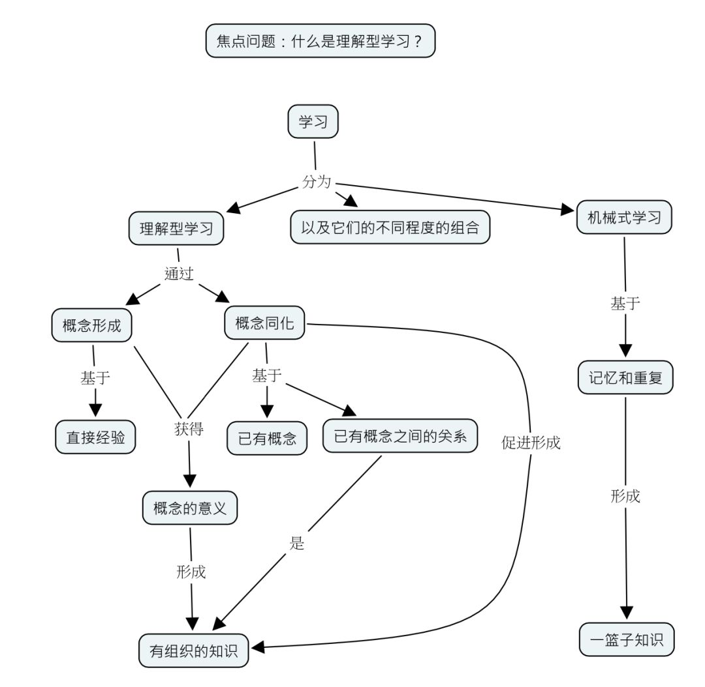

在上一篇`如何学习（四）——带着问题去学习`中我们知道了带着问题可以让我们的学习更聚焦。

在本篇中，我们将讨论在找到了明确的问题、确定了具体的学习材料之后，如何更好地理解新知识？

人类是天生的学习者，我们从小就非常善于学习。我们从出生开始，就无时无刻不在观察和体验这个世界，学习各种各样的动作和技能。

如果你有过带娃的经验，就会惊叹于他们的好奇心和学习能力。最明显的例子是三岁左右的小孩子在没有人刻意指导他们的情况下就能学会如何熟练地操作电子设备，看视频，打游戏，玩的溜溜转。学龄前的儿童对于绘本描绘的多彩世界也是充满兴趣，畅游其中乐此不疲。

令人不解的是，随着孩子年龄的增长，经过小学、中学的阶段之后，很多孩子变的不那么爱学习了，提起学习就痛苦状，家长辅导作业也是一路抓狂。好像是跟学习这件事儿结下了不世之仇，老死不相往来，很多人脱离学校后终身不再读书学习。

我们为什么从一个天生的学习者逐渐变得不爱学习了呢？

那就要说一说理解型学习和机械式学习的恩怨情仇了。

在我们人生的初始阶段，主要的学习方式是理解型学习，这是很自然的一件事情。

按照奥苏伯尔的理论，我们头脑中的概念来自于两种途径，一个叫概念形成，一个叫概念同化。

所谓概念形成，是指个体通过反复接触大量同一类事物或现象的共同特征或共同属性，并通过肯定（正例）或否定（反例）的例子加以证实的过程。概念形成的标志是把握概念的本质特征，并能在实际中运用。

所谓概念同化，就是利用学习者认知结构中原有的概念，以定义的方式直接给学习者提示概念的关键特征，从而使学习者获得概念的方式。学生获得概念的主要形式是概念同化。

概念形成和概念同化的目的是获得概念的意义。学会一个符号或者一个词本身，而不理解它们的意义，就不是概念获得。反过来说，理解某个事物的含义以及这个事物与其他事物的联系，即使在不知道这个事物对应的名词的情况下，也是概念获得。

这种通过概念形成或者概念同化过程获得概念的意义的学习，就是理解性学习。

但是在受到系统性的学校教育之后，我们反而放弃了理解性学习而投入到机械式学习中去，这是一件很不可思议的事情。

既然理解性学习是我们人生初始有效的学习方式，我们怎么会放弃这个基本的、自然的学习方式，而投入到不以获得意义为目标的机械式学习方式呢？

一个思考是，在现代的学校教育体制下，实行理解性学习的代价太大了，效果不如机械式学习快和好。这样的选择出于一种效率的、经济的考量。

理解性学习的过程，需要个体做出深刻的思考，付出比较大的时间成本，好处是可以深刻地理解所学的概念，成为其他概念学习的基础以及思考的基础。对于个体而言，这是最好的学习方式。但对于群体而言，就不见得是最好的了。

作为学校教育，面向的是学生群体，要求有整齐划一的规范和步骤——统一的大纲、统一的教材、统一的课堂、统一的老师、统一的评定标准，这些统一势必跟强调个体差异性的理解型学习方式有些气质不合，而选择可量化、可控制、可操作的机械式学习方式就显得理顺成章了。

学习者从机械式学习的过程中感受不到学习的乐趣，甚至是体验到由此带来的痛苦，也就逐渐疏远学习、厌恶学习了。因为教育而背离了教育，这是一件多么悲伤的事情。

我们所要做的就是找回儿时学习的快乐，重新成为一个理解型学习者。

那么如何进行理解型学习呢？

因人而异，方式多样。这里我介绍几个自己采用的加强理解型学习的方式，算是抛砖引玉吧。

## 1. 联想法

所谓联想法，就是在不熟悉的知识和熟悉的知识之间架起一座沟通的桥梁。

至于形式，可以非常广泛。可以是一个比喻、一个例子、一幅脑海中的画面、一种熟悉的声音、一种鲜艳的颜色、一种情感体验（高兴？悲伤？喜欢？厌恶？）。

总之，只要是能够让我们跟头脑中原有的知识产生某种关联，不管这种关联是以各种方式发生的，它就是有效的。

例如，当我阅读《马斯洛传》时，看到「他在大学期间参加了一个合作生活社团，它设在离校园不远的阿丹姆斯大街上的一座破旧的老房子里。他们共同分担做饭和做家务，和睦相处。」这一情节时，马上就联想到《毛泽东传》中提到青年时期的毛泽东也参加过同样性质的自治社团，同样热烈实践着社会改良的各种方案。

进一步联想，就会发现青年时期的马斯洛和毛泽东在很多地方都颇为相似。

马斯洛比毛泽东晚出生15年，差不多算是同一个时代的人。本来是完全不搭边的两个人，在很多层面上却遥相呼应，精神相通。他们都智商过人，精力充沛，兴趣广泛，博览群书；他们都在青年时期接触社会主义思潮，立志改造世界；他们都有着强烈的理想主义倾向，但又可以用理性思维协调现实，一步步实现自我；他们都有追求大本大源的气质，在各自的领域气吞山河如虎；他们各自走着不同的路，但都达到了“自我实现”的至高状态。

你看，我为这两个东西方的巨人，在很多的层面上建立了关联，从而有助于我根据其中一个人去理解另一个人。在此之前，我怎么会想到把马斯洛跟毛泽东安排在一起进行精神交流呢？这就是随意联想的威力呀。

如果是纸质书，我习惯于在书页的空白处写写画画，进行联想；如果是电子书，应用该方法的效果就会差一些，先进行标注，后续在电脑上追加笔记进行联想。但有时候一些思绪稍纵即逝，不马上记下来，可能就永远丢失了。所以，还是怎么方便怎么来，怎么快捷怎么来。

## 2. 图表法

所谓图表法，就是一副将多个信息压缩在一起的图画，可以让你更加清晰简练地看到知识的骨架和脉络。

至于表达形式，仍然是很广泛的。可以是带有数字信息的表格、一个表达系统内部关系和步骤的流程图、一个表述概念之间关系的概念图，也可以是粗糙简单的随手涂鸦。样式不重要，只要能帮助我们理解知识、梳理关系结构，就是好的形式。

我重点说一下概念图的使用。

所谓概念图，就是一个概念网络。网络上的顶点是概念，网络上的边是概念之间的关系。

一个概念图通常从一个或者少数几个根概念出发，沿着主干道开始阅读，然后扩展到旁边的分支上。一个好的概念图往往有超越层次性结构的连接，称为长程连接，这代表了你思维中一个跨度很大的关联，往往是创造性思维的灵感所在。

我们看一个例子：

这是吴金闪老师的《概念地图学习与教学方法》一书中的一个例子，刚好帮助我们加深一下什么是理解型学习。

我之所以喜欢概念图，是因为它非常像我们大脑中的神经网络。把概念图的顶点想象成神经元，把概念图的边想象成神经元之间的突触连接，那么概念图就映射成了我们的神经网络。用概念图的形式梳理知识结构，就像一步步编织我们的神经网络一样，感觉起来就很炫酷。

我一般是这样使用概念图的。首先把学习材料认真的阅读一遍，过程中会运用上面介绍的联想法加深理解。然后间隔两三天时间，不看阅读材料，只是通过回忆画概念图，如果有些地方模糊想不起来了，再阅读相关部分进行补充，直到完成概念图的制作。然后再间隔大约两三周时间，重新打开概念图审视一遍，看看有没有哪些地方需要调整优化的。随着自己知识结构的更新，原先画的概念图可能会有一些调整。

## 3.费曼技巧

费曼技巧，我在前面的文章中也提到过，这里就简单介绍一下核心步骤：

第一步，选择要学习的概念。

首先选好你打算深入理解的概念，拿一张空白纸在最上方写下概念的名称。

第二步，设想你是老师，正在试图教会一名新生这个知识点。

你要假想自己费尽口舌，让一名毫无这方面知识的学生听懂，并把你的解释记录下来。这一步至关重要，因为在自我解释那些你理解或不理解的知识过程中，你会理解的更好，而原先不明白的地方也得以理清。

第三步，当你感到疑惑时，返回去重新看资料。

当你遇到困难感到疑惑时，别急着往下走，回过头来重新阅读参考资料、听讲座或者找老师解答，直到你觉得搞懂了为止，然后把解释记在纸上。

第四步，简单化和比喻。

现在你手上有一套自己的手写笔记，检查一下，确保自己没有从原材料中借用任何行话，将这些笔记用简单的语言重新组织，或者使用恰当的比喻，使之成为一个流畅的故事。

最后，如果你有身边有一个听众那再好不过了，可以把这个故事讲给他听。如果他能够流畅的听明白，说明你这个过程很成功；如果他有些地方还不是很懂，说明你的故事还有优化的空间。

我会把这个技巧应用在我跟女儿之间，要么我是她的听众，要么她是我的听众。既理解了知识，又增强了亲子关系，何乐而不为呢！

## 4.写文章

写文章的好处网上论述一抓一大把，我就不在这里啰嗦了。

我们平时学习知识，一个很大的错觉就是你觉得你掌握了，但是不是真的掌握了呢？写一篇文章出来，就是试金石。

如果你能够用自己的话很有条理地把知识结构写出来，让别人看了也觉得很有条理，而且能看懂你到底讲了什么，那就是真的掌握了。

所以，写文章真的是一种很好的学习方式。真的，不骗你，不信你写一篇文章试一试就知道了^_^。

（待续）