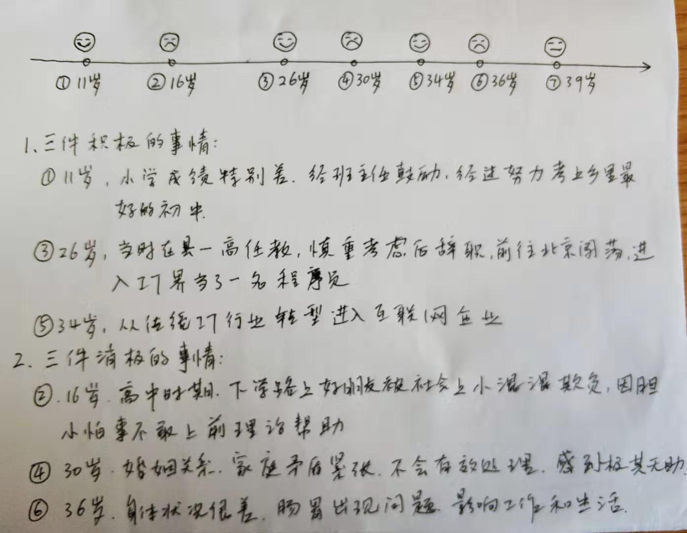

```
这是我在中科院心理研究所上的《职业生涯规划与目标设定》课程的结课作业。

作业题目：
通过所学理论，分析个人发展生涯中的“我是谁”“我要到哪里去”和“我如何去”三个问题。

一、“我是谁”
从过去的因，看到今天的果。通过生命线练习，分析成长中的三件积极事件和三件消极事件，
看看过去的事件如何塑造了今天的自己。

积极事件：看到每个事件中，当时的目标是什么？难点是什么？如何突破困难或界限的？
完成时发现了自己有什么样的优势能力或潜能？

消极事件：看到那个当时对自己打击很大，或至今都耿耿于怀的事，探索这些事件中自己的
思维和行动的模式，琢磨如果请今天的自己给当时的自己一个建议，什么样的建议会能够帮
助到自己渡过难关。

二、“我要到哪里去”，“我如何去”
自己未来希望得到的“果”是什么，今天与未来的那个果之间有什么差距，那么要在今天播种
哪些因，如何才能得达到未来的果。
```

一、我是谁？



1.  三件积极的事件
    1.  11岁，小升初。小学阶段我的成绩特别差，经常考不及格。不知道是因为贪玩还是因为笨，反正觉得学习没有乐趣，也没有升学的希望。我父母因为文化程度不高，对我的学习也不太在意，家庭教育基本处于放任自流的状态。小学前几年就是这样混过去的，刚升上五年级的时候，状态依旧。有一天我的班主任专门找我谈话，具体谈的什么今天已经忘记了，但核心思想就是：你是有潜力的，你现在学习不好是因为你不努力，马上就升初中了，你为什么不拼一把试试呢？难道你想小学毕业就回家种地吗？不知道当时老师的这番话怎么就刺激到了我，反正从那儿以后我就开始努力学习了，后来就顺利地考上了乡一中。在我人生的最初阶段，这件事意义非凡。如果不是老师当时注入一剂强心针，洒下信任和鼓励的话语，我就会一直以为自己是地地道道的学渣，继续懵懵懂懂、浑浑噩噩的度日；如果我不能顺利考上初中，我的学习生涯可能就会提前结束，就会像村里很多的同龄人一样早早地务农、务工，我的人生就会彻底改写。我非常感谢老师的那次谈话，那场改变我一生的谈话。

    2.  26岁，从高中辞职去北京闯荡。2003年大学毕业后我进入县一高任教。所教的信息课在高中只是一门副科，不参加高考，不受到重视。我郁郁不得志，就萌生了辞职去外面闯荡的念头。到了2005年，这个念头尤为强烈，决定付诸于实施。但当时遇到的阻力非常大。首先，我的父母坚决不同意，觉得这样一个人人羡慕的公职我弃之如敝履，实在是脑壳坏掉了；其次，我当时的女朋友也在学校教书，同样不支持我外出闯荡，觉得未知的风险太多，其中就包括我们的关系。但我意已决，就觉得男子汉大丈夫志在四方，怎可一辈子蜗居于此？我用连绵不绝的攻势“说服”了我的父母，这种“说服”很可能得力于我对母亲的最后一跪，让她看到了儿子无与伦比的决心，他们终于放手了。2006年3月，我顺利入职北京一家软件公司，成为一名程序员。从此我的北漂生涯拉开了帷幕。这个事件是我人生中一个重要的转折点。原本我的人生已经定格在一个县城的中学，拿着微薄的工资，从事着可有可无的教学工作，十几年如一日，波澜不惊地度日；当退休之后回首往事，我可以评定自己是一名真正的默默无闻的人民教师。但这不是我想要的人生！北漂生活充满艰辛迷茫，前路漫漫未可知。但我竟然愿意投身于这漂泊汪洋之中，为什么？我也一遍遍地问自己。十几年前决定出乡关飘零帝都之时，我可能并不甚明了其中的意味，只不过是年少轻狂意气风发罢了。但现在，我可以清晰地说出这条路的价值所在了——因为这是一条成长之路。我无法容忍自己在一个原点踱步不前，我需要不断地成长，不断地超越自我。

    3.  34岁，从传统IT行业转型进入互联网行业。到2014年，我已经进入IT行业8年，经历了初级程序员、中级程序员、高级程序员、软件架构师的成长之路。然而，我又面临职业生涯的一个艰难抉择：是留在自己熟悉的传统软件行业，还是转型到互联网行业？留在自己熟悉的传统软件行业，路轻驾熟，得心应手，自然轻松一些。而当时，互联网行业方兴未艾，各种新的技术和软件架构层出不穷，令人耳目一新。是保持现状？还是拥抱变化？是每一位IT技术人都会面临的选择。我已经34岁了，已经算是IT届的老兵了，我还有能力和精力去进行这样的转型吗？从传统IT行业进入互联网行业，无论从软件架构、开发部署模式，还是从编程语言、技术规范等层面，都要接受全新的洗礼。能不能转型成功，我还是有点担心的。2014年8月，我从之前的传统IT行业的软件公司离职，没有立即找工作，而是专门花了3个月时间学习新的适合互联网行业的软件技能。觉得心里有底了，才在2014年11月加入了一家互联网架构的创业公司，正式开始了我的互联网之路，一直到今天。通过这次转型，我再一次确认了自己的潜能：学习能力和拥抱变化。这是人生的立身之本，我拥有、我发挥、我壮大。

2.  三件消极的事件
    1.  16岁，高中时期，因为胆小怕事没有在朋友遇到危险时伸出援手。当时正在上高一。一天放学后，跟同乡的一位同学骑自行车一起回家。走到县城的后街时，突然被一群社会上的小混混拦了下来。他们让我同学留下，让我走开。我当时脑子一下子就懵了。这是什么情况？我该怎么办？我要冲上去吗？我要跑掉吗？我跑掉后同学会怎么样？我脑子快速地运转着，迷乱地思索着应对之道。很明显那个同学遇到了麻烦，不知道怎么得罪了这些人，现在拦下来要给他点颜色瞧瞧。让我走开，看来这件事跟我没关系。那我要不要走来？不走开，估计要挨一顿揍；走开吧，觉得对不起同学，有一种强烈的内疚感。我正杵在旁边，脑子里胡乱思索着各种假想场景时，听到“啪”的一声响——那个同学被抽了一耳光，那感觉就像抽在我脸上一样火辣辣的。我心里哆嗦了一下，低着头推着车子走了几步，又停了下来，用眼光向那边瞟着，观察着形势的发展。我是如此的胆小怯弱，没有勇气冲上前去帮同学解决冲突，因为害怕挨揍；但我的羞耻心和最后一点残存的勇气又阻止着我彻底跑掉。我就这样远远地看着，直到我那个同学被“修理”完。后来，我打听了一下，才知道是班里的另外一个同学使坏。他们两个闹了矛盾，就指使社会上的小混混来教训这个同学。虽然我不想卷入这样的同学纠纷，但我仍然为自己的表现感到惭愧和羞耻。我胆小怕事，我害怕冲突，我不知道怎么面对这样的恶性事件。那个画面如此地刻骨铭心，让我深刻地意识到自己性格中软弱、胆小、自私的一面。在以后的人生历程中，我也一直看到它们牢牢地抓紧我，把我拉向深渊，而我也一直在努力的抗争，把自己拉出深渊。如果放在今天，我大概率仍然不会像英雄一样拔剑而起，但我会走向前去，表明我的立场，跟他们理论一番，努力阻止暴力行径的发生。恶势力也有它们的弱点，并不像表面上看起来那么可怕，只要我们勇敢地面对，还是有回旋的余地。而一味退缩、委曲求全，从来不是真正的生存之道。

    2.  30岁，婚姻状态糟糕，家庭矛盾升级。在女儿出生以前，我们夫妻的感情还很好，偶尔有些小矛盾，也可以很快消融掉。自从女儿出生以后，带来了新的家庭关系的挑战，让我措手不及，极其沮丧而无助。我因为工作繁忙，没有太多的时间照顾家庭，女儿基本上都由我太太照看，这让她很是疲惫，产生了一些负面情绪。我当时在亲密关系上的认识上极其浅薄，没有有效的方法去化解这种情绪上的冲突，而是采取对立和激进的态度相抗衡，自然越来越糟糕。有一段时间，我父母过来帮着带孩子。没想到情况更加恶化，在原有夫妻矛盾的基础上又新添了婆媳矛盾，让家庭的冲突的进一步升级。我赶紧让父母回去，减小冲突的战场。前前后后，这种情绪上的冲突，大概持续了三、四年之久，我们的夫妻感情严重受挫，已经走到了婚姻破裂的悬崖边。这件事情对我的打击之大，难以想象。有一段时间我万念俱灰，甚至想着剃度出家，了却红尘。但到了2015年，我突然醒悟了。我对太太说：“这是我一生中遇到的最大难题，比我上学读书时遇到的难题要难上千万倍，但我必须把它解决掉。”我开始尝试从技术人的思维角度抽离，拓展人生中其它的维度——亲密关系、心理结构、人际交往以及人生百态。我开始看技术之外的书籍，心理的、社会的、历史的、哲学的等等，凡是能帮助我拓展自己的眼界和思维高度的，我都涉猎一番。在2015年决定学习中科院心理研究所的心理学课程，也有同样的原因——我想解开这道难题——为什么我的婚姻生活如此糟糕？走过这么多心路历程，我终于明白一个道理：你改变不了别人，你只能改变你自己！而事物的状态又是相生相随、互相依存的，你改变了自己，就会引起事物状态的改变，也就改变别人的态度。我终于从我自己家庭婚姻的实践中，印证了这条人生的真理。它确确实实改变了我的人生！再回首过去十年跌宕起伏的婚姻生活，感慨万千，几近泪目。但这个人生最大的难题到底被我找到了钥匙，还是挺欣慰的。

    3.  36岁，身体状况很差，肠胃出现问题。我自幼体弱多病，应该跟营养不良有关系，小的时候家里穷没有多少营养可以补充，生活目标就是能吃饱。参加工作后，吃喝不再成为问题，加上意识到自己的身体基础差，平时多注意锻炼，基本上还过得去。前几年在传统IT行业，工作节奏还算合理，下班后基本有时间休息和锻炼。锻炼方式有走路、慢跑、游泳、体操等，身体的整体素质是慢慢上升的。后来转型到互联网圈子后，工作节奏明显加快，晚上加班成为常态，有时候周末还要加班，再加上饮食不规律和不健康的因素，长期积累下来，身体就开始吃不消了。终于，在2016年身体开始爆发了。先是急性肠胃炎，住了医院，做了胃肠镜。还好没有大的问题，修养了一段时间有所好转。但那一年明显感觉身体状况变差，没有精神，容易疲劳，记忆力变差。身体已经敲响了警钟！我意识到不能再这样干下去了。互联网行业虽然充满机遇与挑战，但同时也“毁人不倦”。我这样先天羸弱的身体条件，投身于如此高强度的互联网大潮，似乎有点为难自己了。从那以后，我开始刻意放慢脚步，关注自己的身体健康，因为这是人生的根本——没有一个好身体，一切都无从谈起。我仍然愿意站在互联网的浪潮中，但我希望用健康的身体和良好的心态去享受这个时代的潮涌，而不是被它席卷着、挟裹着失去了自我。
 
二、我要到哪里去？

我将来要成为一个什么样的人？
这是一个伟大的问题！
站在四十岁的关口，问这个问题，似乎不像二十岁时那样令人意气风发，但这样的一问仍然有它振聋发聩的价值。
记得在我二十岁时曾发出的这样的一问，答案有三个：第一、我想成为一名程序员；第二、我想成为一名推销员；第三、我想成为一名大学老师。
第一个梦想来自于我的专业。当时我正在学习计算机科学与技术专业，希望学有所用，想成为一名程序员。这个梦想我已经实现了。
第二个梦想来自于一本书：《最伟大的推销员》。不知道什么因缘我当时对这本书很是痴迷，看的热血沸腾，梦想着将来也成为那样伟大的推销员。这个梦想还没有实现。
第三个梦想来自于我的一个同学。有一次我们聊天，说到毕业之后的去向时，我就说毕业后自然是去中学教书啦（我们是师范院校，毕业后普遍就是去中学教书）。他不屑地看着我，很坚定地说：“要当老师，就当大学老师！”我当时印象很深刻，就把这个目标归入了我的梦想清单。这个梦想也没有实现。
二十年过去了，我的梦想清单实现了三分之一。现在重新问这个问题：我将来要成为一个什么样的人？有新的答案吗？
后两个梦想大概率上不会实现了，所以我需要修正一下我的梦想清单：第一、我想成为一名程序员；第二、我想成为一名独立学者。
其实，我也不理解到底“独立学者”是干什么的，就像二十年前我不理解我定下的那三个梦想一样。在你没有真正成为那个目标之前，你无法真正理解那个目标的存在。
但这一点也不妨碍我追求这个目标。
百度上对所谓的“独立学者”是这样定义的：“不隶属于任何官方、高校或法人机构的具有一定水平的专业研究人员。并享有职业自由，更表现为思想独特而纯粹，不以某组织利益为研究导向。”
 
三、我如何去？

我现在的身份是程序员，那么我要怎么成为一个独立学者呢？
我总结了一下，大概需要这几个方面的努力。

1.  提高自己的人格修养。
要成为一名受人尊敬的独立学者，没有高尚的人格修养，是万万做不到的。即使我的专业技能再精湛，如果我道德卑劣、丧心病狂，没有人会听取我的只言片语。
我要如何提高自己的人格修养呢？
首先，我要向那些古今中外的先贤圣哲学习，读他们的传记，了解他们的生平和思想，从他们的人生中吸取前进的力量。
其次，我要学习儒释道各家的经典，这是人类文化的瑰宝，我要从这些传世经典中吸取精神食粮。
最后，我要加以道德实践，做到知行合一。没有行，就没有知。没有道德实践，前面的一切都是虚幻泡影。

1.  提高自己的专业技能。
要成为一名真正的独立学者，只有高尚的道德情操，也是走不远的。人格修养和专业技能就像我的两条腿，缺一不可以顺利前行。
我要如何提高自己的专业技能呢？
首先，要明确自己的专业领域。假如我要抛开目前的专业，成为另外一个领域的独立学者，就需要明确自己的战场在哪里？我不可能漫无目的地发力，最终只能一无所获。比如目前我有几个选项：第一、认知科学领域；第二、历史细分领域；第三、人类学领域。具体选择什么领域，还要看我在这几个方面研究的深度和潜力。
其次，在自己的专业领域内深耕细作，成为这方面的专家。措施不外乎这几个方面：第一、大量的阅读；第二、找同领域的专家学者交流；第三、进行创新性的思考；第四、用实践检验理论认知。
最后，要输出。输出的形式可以很多样：第一、写公众号文章；第二、做演讲交流；第三、出版书籍；第四、跟机构合作实践你的理念。

1.  锻炼好自己的身体。
这个很重要，但也最容易被忽略。切记切记！
锻炼的形式要多样化，不可拘泥于形式和场所。
我经常采用的锻炼方式有：散步、快走、慢跑、体操、深蹲、观呼吸、打坐冥想、爬山。
身体是革命的本钱！这个真是一点也没错。

1.  经营好自己的家庭。
因为之前的人生经历，让我深刻地认识到了家庭和谐的重要性。
就像外出宿营时先把营地扎好，你才能安心地四处探险一样，家庭对于我们就像那个后方保障的营地，失去了营地，我们的探险之旅就要夭折了。
我要多理解太太的辛苦，体会她照顾家庭和孩子的不易，包容她的一些负面情绪。
我要分出时间和精力参与家庭事务和照顾孩子，关注孩子的教育和成长。
我要时刻提醒自己：遇到任何烦心的家庭事件，都不能情绪失控。学会控制自己的情绪，是心灵成长的第一步。
我要时刻提醒自己：在试图想去改变别人的时候，先想想自己：我做到了吗？我采用双重标准了吗？我是在情绪平和的情况下做出的判断吗？
家庭是一个生命共同体，我们需要共同成长，才能营造家庭的和谐和幸福。

1.  开拓自己的视野，提高自己的认知水平。
作为一个独立学者，在专注于自己的专业领域的同时，还需要努力开拓自己的视野和格局。
人类文化的底层逻辑都是相通的，一个学者不可能在不关心其它领域的发展成果的情况下保持自己专业的先进性和创新性，这无异于坐井观天。
我如何开拓自己的视野和格局呢？
最高性价比的方式：阅读！阅读！阅读！
选择那些可以提高我们整体认知框架的、自己感兴趣的、跟自己专业领域相关联的各个领域进行广泛的阅读，日积月累，量变引起质变，不知不觉中得到升华。
除了阅读，开拓视野和格局的另外一个途径就是游学。用脚步去丈量山川河流，用心灵去感受万千事物。
古人云：读万卷书，行万里路。一言道尽。

1.  提高自己的写作水平。
写作水平是基本功。
学者就是靠这两项吃饭：一个是写，一个是说。
我要如何提高自己的写作水平呢？
首先，多看。看多了才会知道哪些是好的文字、哪些是不好的文字。
其次，多写。写多了才会知道哪些地方不足，逐一改正。
最后，多改。不记得哪位作家说的了：好作品都是改出来的。

1.  提高自己的演讲水平。
我不擅长写，尤其不擅长说。往往一上台演讲，面红耳赤，心跳加速，呼吸困难。
我如何克服这个困难呢？
首先，我可以自己练。对着镜子练。
其次，我可以参加一些演讲训练营，跟大家一起练。
最后，我要克服胆小脸皮薄的臭毛病，争取各种上台的机会，采用系统脱敏法逐渐地克服演讲的心理问题。

1.  提高自己的英语技能。
作为一个学者，要保持自己的思想和知识结构的前沿性，不阅读英文的文献是不可能的。以后有机会出国游学的话，还需要能跟外国的学者交流。所以说，英语技能的重要性不言而喻。
但英语恰恰是我的软肋，因为太懒，也缺乏科学有效的学习方法。
之前看到一个SSS（Start with Simple Stories
）的语言学习法，大意就是通过由浅入深的广泛阅读来培养语感。目前正在采用这种方法来学习英语，希望会有好的收获。
