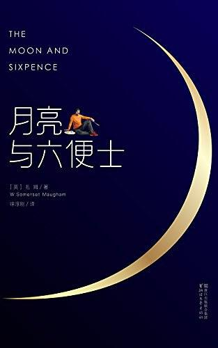
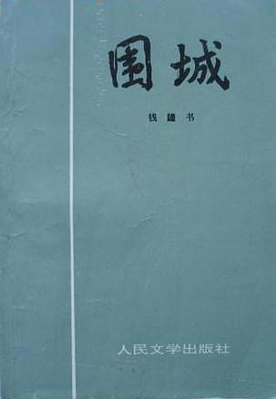
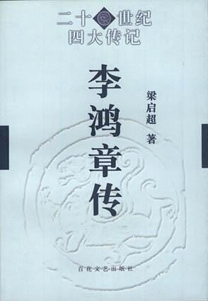
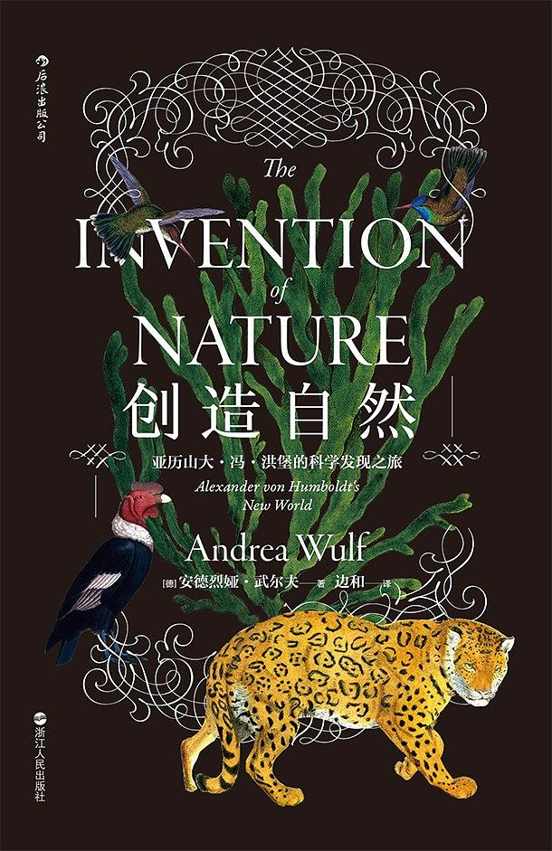
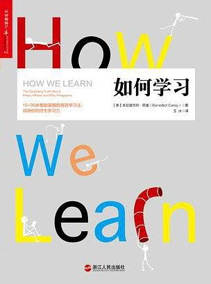
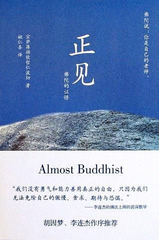
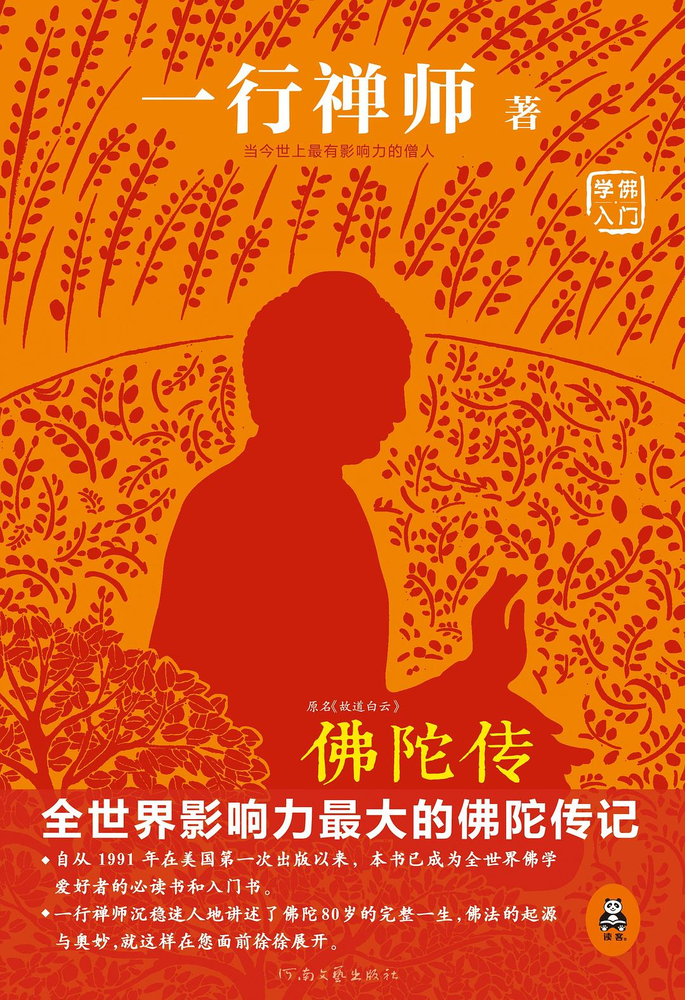

1. 《月亮与六便士》

[豆瓣链接](https://book.douban.com/subject/26954760/)

【五星推荐】

理想与现实，灵魂与肉体，精神与物质，人生的取舍，生命的真谛。徐徐展开，拷问着我们的灵魂。是抬头向往那皎洁的月亮，还是低头捡起地上的六便士？何去何从，每个人都有自己的选择。

2. 《围城》

[豆瓣链接](https://book.douban.com/subject/1464989/)

【五星推荐】

提起《围城》，很多人自然就会想到杨绛先生的那句名言：“围在城里的人想逃出来,城外的人想冲进去,对婚姻也罢,职业也罢,人生的愿望大都如此。”

这本书的文学价值和思想价值，不用多说，钱钟书先生就凭这一本书就可以跻身世界文学的殿堂，而且经久不衰。

《围城》的电视剧也不错，忠实原著，可以跟书本结合着看。陈道明的演绎很到位，除了他甚至想不出来还有谁可以演绎好方鸿渐这个角色了。

3. 《李鸿章传》

[豆瓣链接](https://book.douban.com/subject/1076685/)

【五星推荐】

梁启超版本的李鸿章传，无论从文字语言还是史料内容上，都是经典之作。

4. 《创造自然》

[豆瓣链接](https://book.douban.com/subject/27145016/)

【五星推荐】

地理学家、博物学家、植物学家亚历山大·冯·洪堡的传记。然而不仅仅是一部传记。它纵横捭阖、包罗万象，集自然、人文、历史、传记、政治之大成，波澜壮阔，如煌煌史诗。文字生动优雅，引人入胜，是我这几年读过的最好的自然文学作品。

5. 《笑傲江湖》

[豆瓣链接](https://book.douban.com/subject/1002299/)

【五星推荐】

明写江湖，实写人性。有人的地方就有江湖，有江湖的地方就彰显人性。光明与黑暗，纯洁与污秽，崇高与卑贱，交错纷纭，波浪起伏，人生百态，荡气回肠。

6. 《如何学习》

[豆瓣链接](https://book.douban.com/subject/27081766/)

【四星推荐】

作者介绍了在学习科学领域最新的一些研究成果，还花了大量的篇幅试图说明它们背后的研究背景和心智原理。

如果你知识希望应用这些学习方法的话，实际上总结下来就几条：
1.由集中式学习转变为分散式学习；
2.由重复式学习转变为交替式学习；
3.变换学习场所有利于改善记忆；
4.绞尽脑汁想不出来的问题就放下来，去做做别的事情，说不定会柳暗花明；
4.善用预先考试、回想等手段加深学习效果；
5.利用知觉学习策略快速学习；
6.不要忽视睡眠，睡眠也是一种学习。

7. 《正见》

[豆瓣链接](https://book.douban.com/subject/25902141/)

【三星推荐】

主要讲佛法四圣谛的，也叫四法印，但感觉讲的不是很透彻，反正我看完后还是有点懵，反而不如看《佛陀传》后对四圣谛的理解深刻。不过在什么是真正的佛教徒标准上讲解的很好，让我对真正的佛教徒有了清楚的认识。

8. 《佛陀传》（原名《故道白云》）

[豆瓣链接](https://book.douban.com/subject/25819842/)

【四星推荐】

用平易近人、生动有趣的文笔娓娓道来佛陀传奇的一生，并穿插详解了佛法的要旨：四圣谛、八正道、空无自性、十二因缘、五蕴、三解脱门、禅修等，是一部优秀的把思想真谛和传奇人生完美融合呈现的传记作品。通过这本书可以很好入门佛教。
