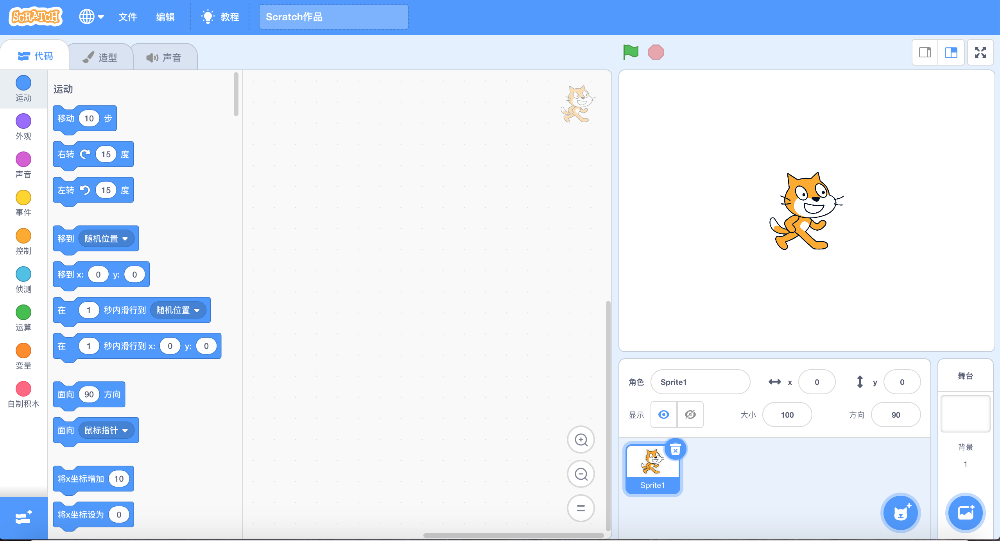
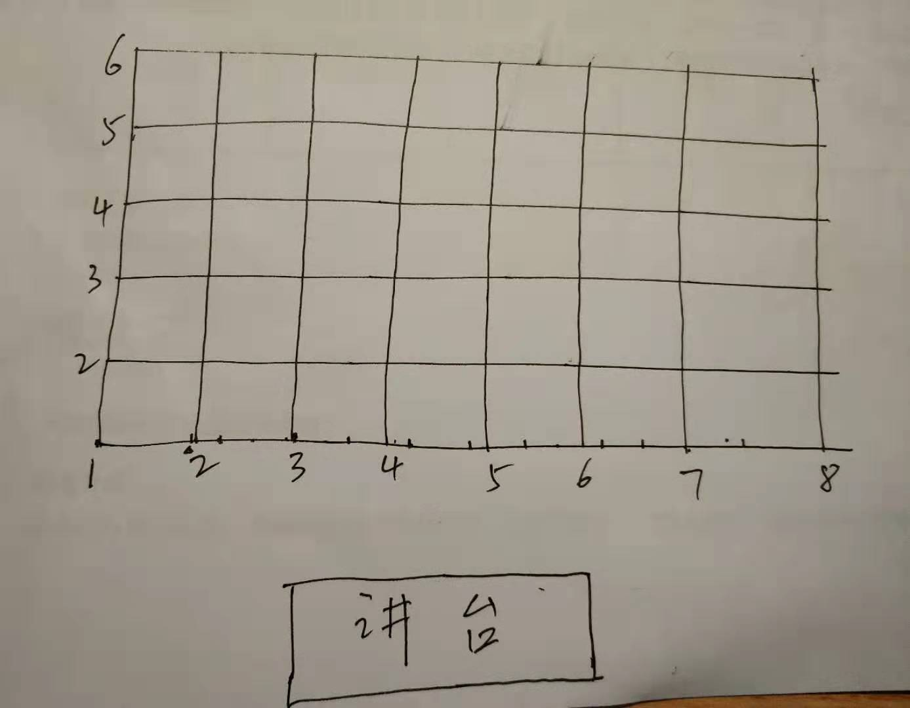
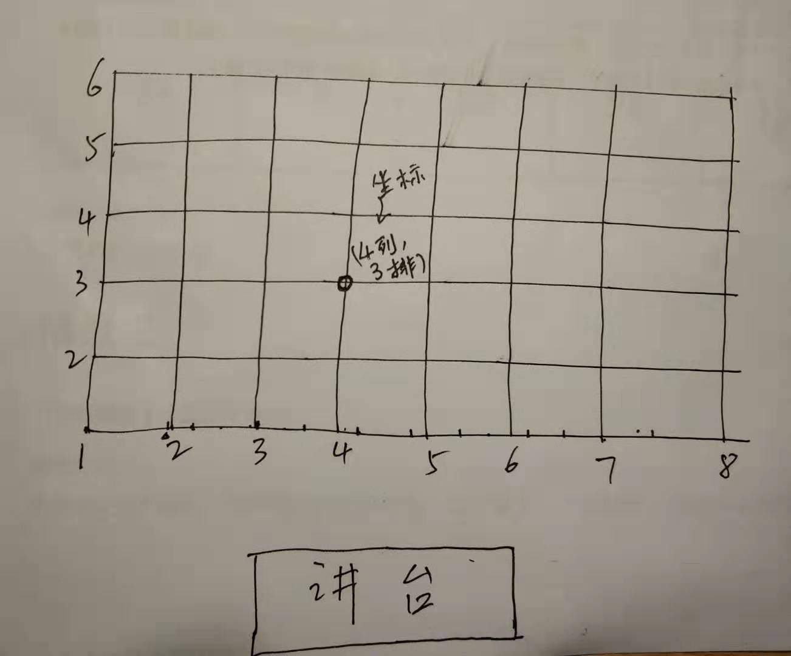
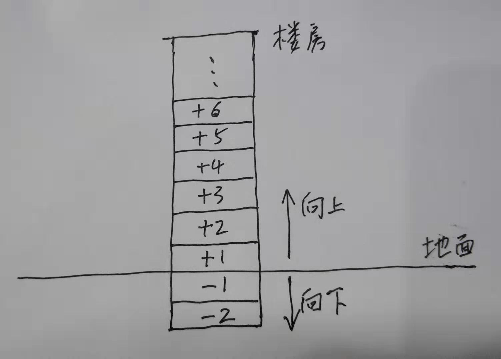
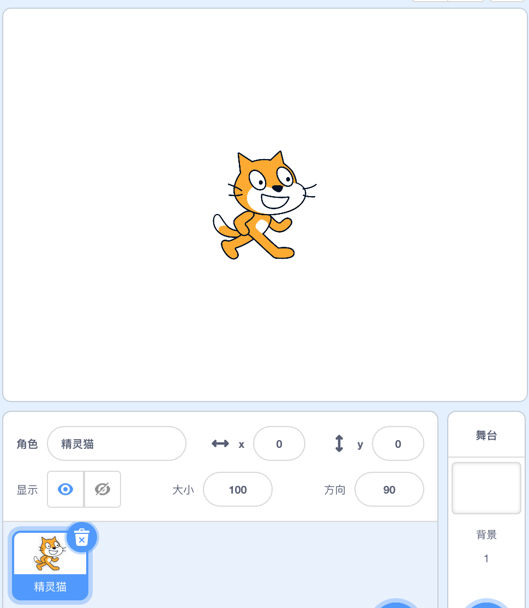
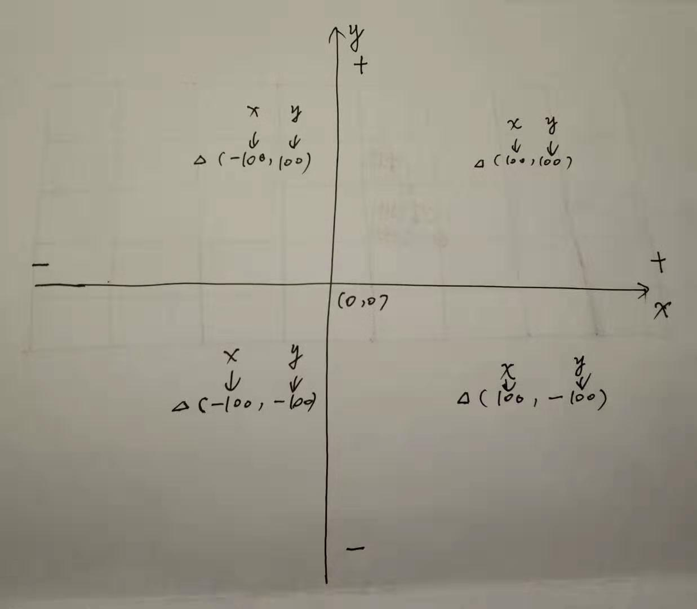

在女儿充满期待的目光中，我打开电脑，点击了一下那个可爱小猫咪的图标，打开了scratch软件。

（不同的操作系统上界面会有不同，以下图示都是macOS下的样例)

初始界面是这个样子滴：

我家小公举的目光立刻被右上角那个瞪着大眼睛、咧着西瓜嘴、翘着小尾巴、快乐前行的小猫咪给吸引了，这个造型是她的最爱。

这就是风靡全球的儿童编程软件——scratch。下面是维基百科对scratch的简要介绍：

> Scratch是麻省理工媒体实验室终身幼稚园组开发的一套计算机程序开发平台，旨在让程序设计语言初学者不需先学习语言语法便能设计产品。开发者期望通过学习Scratch，启发和激励用户在愉快的环境下经由操作（如设计交互故事）去学习程序设计、数学和计算知识，同时获得创造性的思考，逻辑编程，和协同工作的体验。
Scratch适用于8岁以上用户。即便用户从未学过程序编程，通过拖曳预先设定好的积木式程序模件，堆栈出指令，设置或控制角色及背景的行动和变化，从而完成程序设计。

scratch的界面对于儿童来说，简洁、明快、友好，关键还有那个首先映入眼帘的可爱卡通猫，可以快速地抓住儿童的注意力与好奇心。

我家小公举已经急不可耐了，把小猫咪摁在鼠标下面一通揉搓，想看看到底所谓的编程猫能变出什么花样。

我及时制止了她这种简单粗暴的行为，并告诉她小猫咪很可爱，但不是这么玩的。

“你想不想让它听你的话，不用鼠标就能让它跑来跑去，往东往西，上蹿下跳，喵喵直叫，怎么样？”

小公举这下兴奋啦，他说爸爸你要给我变魔法？嗯，对，就是魔法，下面就是见证奇迹的时刻。不过，在见证奇迹之前，我要先给你讲一讲另外一个故事——坐标的故事。

对于儿童首次使用scratch软件，坐标系统是个绕不过去的坎。儿童如果不理解坐标的概念，就没有办法使用指令去控制场景中角色的移动。你不能说把猫咪移动到这里！把猫咪移动到那里！这里是哪里？那里又是哪里？位置需要用坐标值来表示。

我一开始并没有给我家小公举讲任何具体的编程指令，在scratch中编程指令的设计足够简明和友好，对于一个三年级的儿童来说，理解它们的含义不是什么难事。

比如看下面这些编程指令：

一个8、9岁的孩子会不理解这些话大体上要表达什么含义吗？

他们不理解的是里面那些数字在这里表达什么意思，是因为里面有坐标的概念存在。

所以，充当其冲就是要给他们讲明白坐标是怎么回事。

## 坐标的故事

我拿出一张纸，开始问女儿。

“你们班总共多少排？”
“6排”
我在纸上画了6根横线。

“总共多少列？”
“8列”
我又在纸上交叉画了8根竖线。

我指给她看，这些交叉的每个点都代表你们班上的一个座位，你们班的座位是不是这个样子？

她点了点头。

“好，现在我们看啊，假设你们开学第一天，老师还不知道你们的名字，但她又想让其中一位同学回答问题，她可不可以这样说：’第三排、第四列的同学请回答问题。’”

女儿看了看纸上的位置，推演了一下，貌似觉得没啥问题。

我告诉她，这种表示法就是一个典型的坐标系统——用横向的一个数字结合纵向的一个数字定位一个位置，这样就可以方便地提问到你们班的任何一个同学，即使老师不知道他们的名字。

我估计她们老师在班上已经使用过这种定位方法，我家小公举马上就理解了这个坐标系统。

我一喜，大功快告成。

剩下的一个问题就是负数的概念。小学三年级还没有讲到负数的概念，在坐标系统中直接使用负数可能会让她困惑，需要明确一下这个概念。

我又开始问女儿。

“咱家的车停在什么地方？”
“楼下呀。”
“楼下几层？”
“负2层。”
“咱们平时都是怎么去负2层的？”
“坐电梯。”
“坐电梯摁的哪一个按钮？你把那个按钮上的数字给爸爸写一下。”

她就在纸上写了一个大大的“-2”。

“好，你知道这一层为什么叫负2层吗？”
“因为在地下呀。”

Bingo! 接着我就在纸上画下了这幅图：

“你说的没错，正是因为负2层在地下，而且它相对于地面来说是向下了2层，所以用-2来表示，而我们住的楼层是8层，而且它相对于地面来说是向上了8层，所以用+8来表示，而正数前面的+号可以省略，所以平时我们就直接说8层就可以了”

基础知识差不多普及完了，在她心里对坐标系统有了一个基本的认识，剩下的就是在具体的编程实践中领会和加强了。

我指了指小猫所在的位置，告诉她这个区域就是小猫的舞台，小猫就是这个舞台上的角色，现在小猫所在的位置叫原点，用（0,0）来表示，小猫可以在舞台上任意移动，移动到的位置用坐标来表示。你想象一下这个舞台就是你们的教室，小猫咪就是你，你下课后在教室玩，一会跑到这个座位上，一会跑到那个座位上，每个座位都是你们教室的一个坐标。

对应的坐标系统如下：

横向用x表示，纵向用y表示，中间交叉点称为原点。在横向这条线上，原点右边是正数，原点左边是负数；在纵向这条线上，原点上边是正数，原点下边是负数。+和-在这里你可以理解为方向，以原点为出发向外辐射的方向。我在这4个区域各取一个位置，它们的坐标分别是这样的。。。

吧啦吧啦我正说的带劲呢，偷偷瞄了一下俺家闺女，我知道该打住了，小公举已经有点不耐烦了。小猫咪带给她的兴奋快要被这个该死的坐标给淹没了。

好，下面正式开始啦。

一听这么说，小公举的热情又被点燃了，抓起鼠标又准备去摁小猫咪，我赶紧把她的小手给摁住。

（待续）
