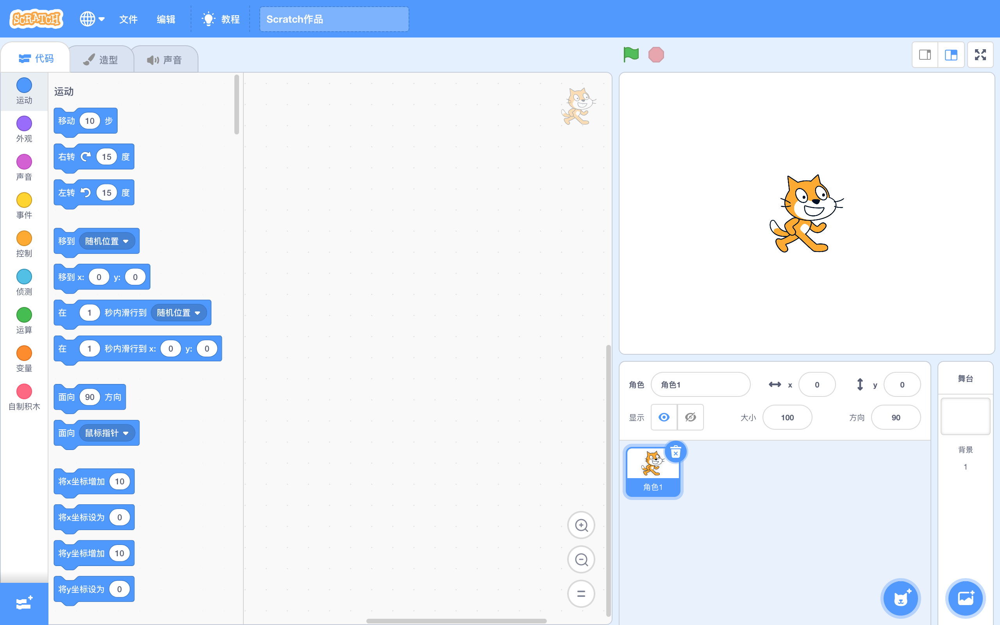
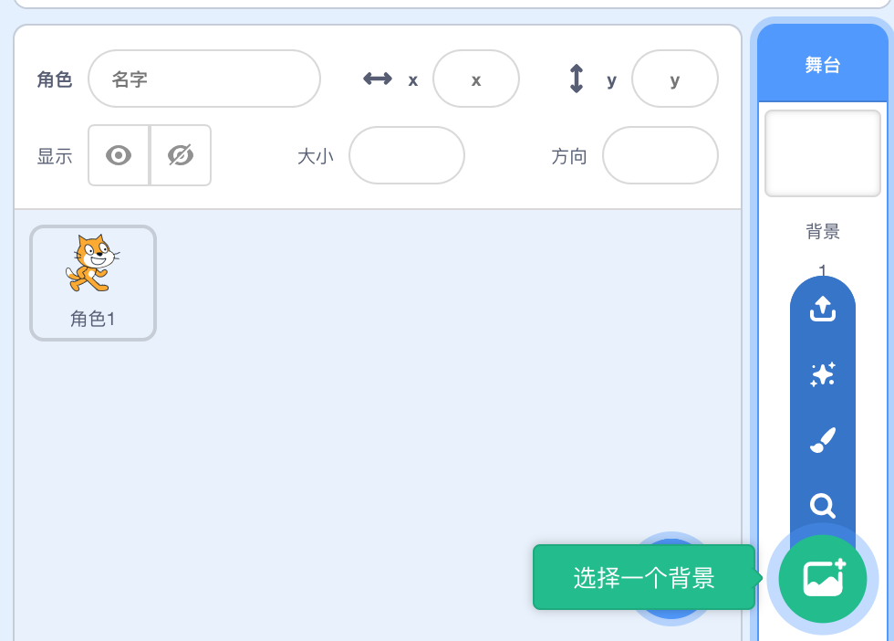
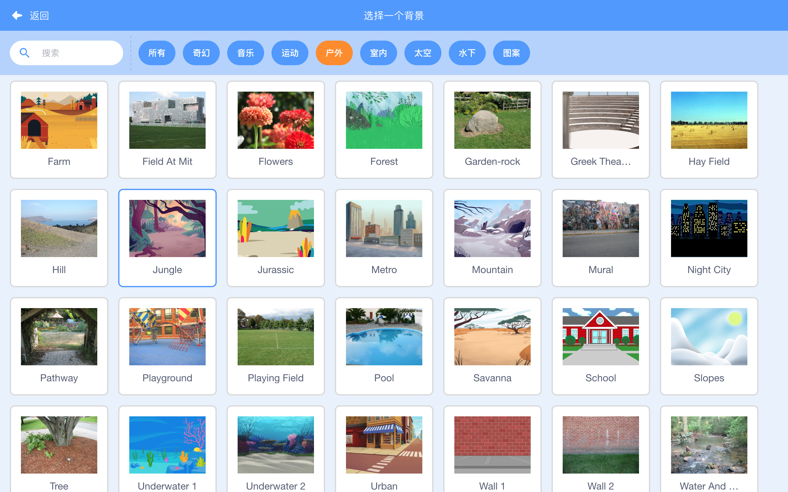
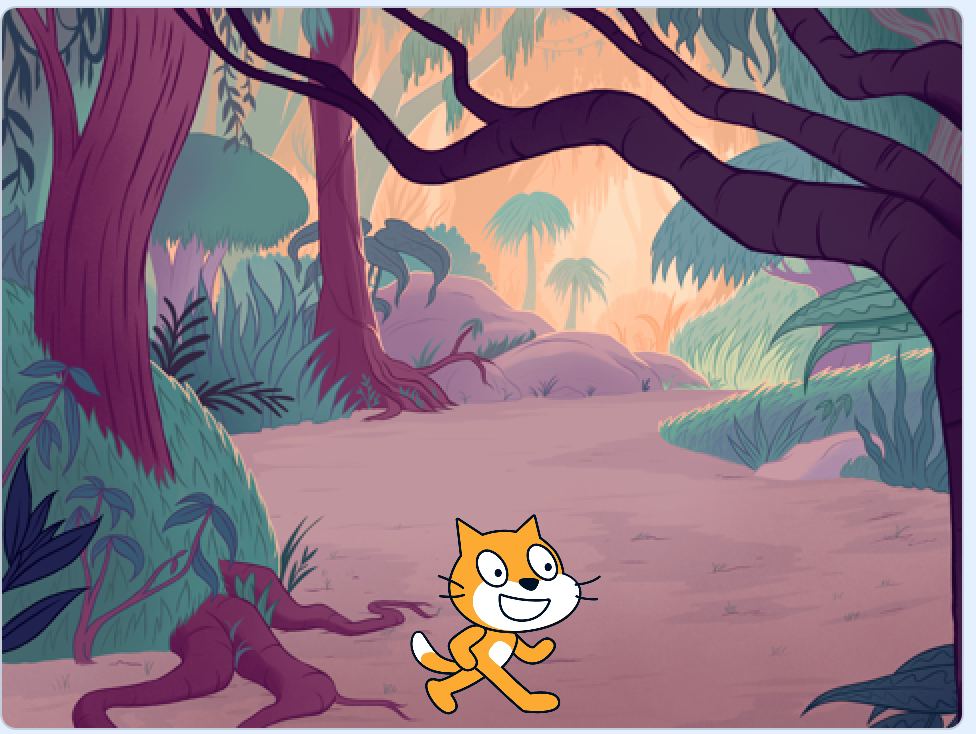
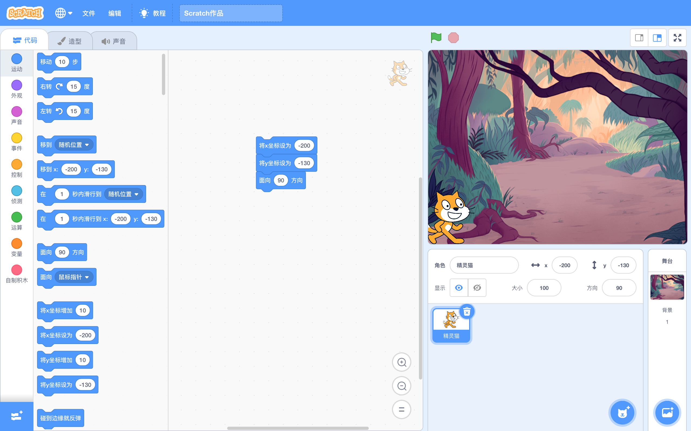
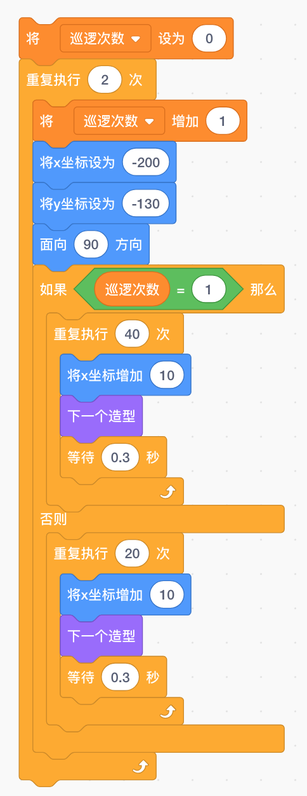
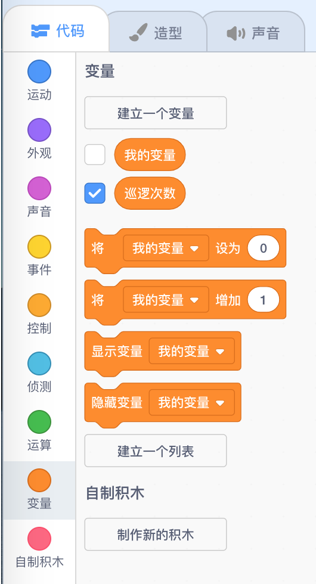
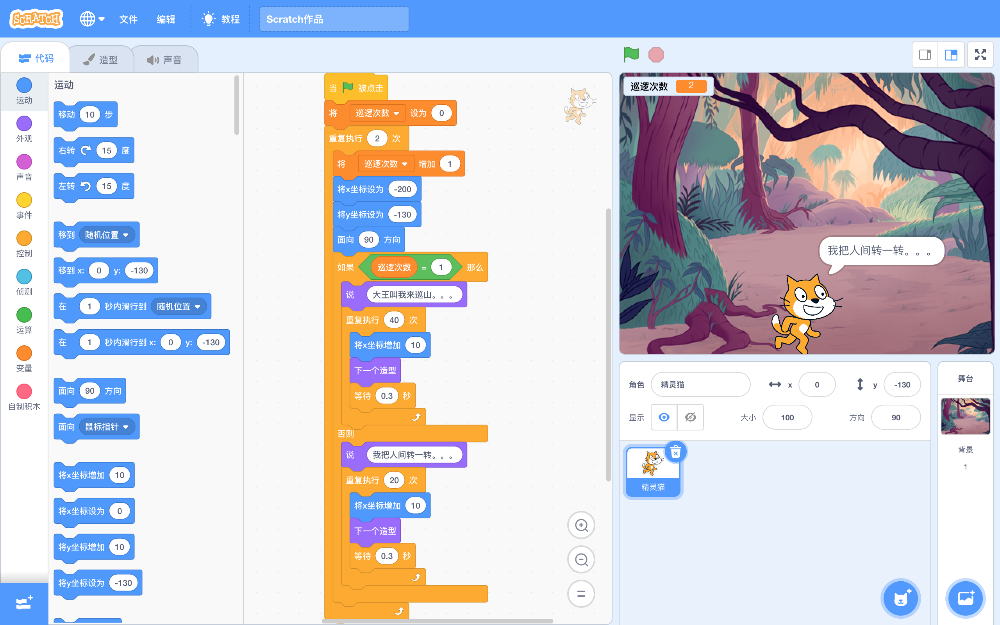

首次使用Scratch对儿童进行编程启蒙，切记不要陷入技术细节，整体上要以趣味性为主，以培养他们的兴趣。

兴趣才是最好的老师。

我对女儿说：“你看，舞台上已经有一只小猫咪了，你可以想象一下这只小猫要去干什么？遇到谁？发生了什么事？简单地编一个故事出来。爸爸跟你一起把这个故事在舞台上演出来，好不好？你先在纸上画一画吧。”

女儿兴致高昂，立马在纸上写写画画，构思她的故事啦。

我趁这个时机刚好去偷闲片刻，哈哈~~

我在沙发上坐了一会儿，刚刷了一会儿手机，女儿就跑过来，说可以啦，并且拿一张纸让我看。上面有几颗树，有一片草地，除了地上有只猫，空中还飞着一只像蝙蝠的鸟。

我说你给我讲讲，这是个什么故事。下面就是小公举编出来故事：

这是一片森林，精灵猫是这里的守护神，负责保护这片森林和这里面的小动物。它每天会在森林里巡逻，负责这里的安全。有一天，它正在巡逻，飞来了一只蝙蝠侠，要占领这片森林，把这些小动物都赶出森林。于是它们就打了起来。最后精灵猫打败了蝙蝠侠，成功保护住了这片森林，森林里的动物又可以快乐地在这里生活了。

我听完沉默了一小会儿，心里直犯嘀咕。一上来就这么高难度动作，能不能整出来还两说呢？Scratch我也是业余选手啊! 不过这牛吹出去了，硬着头皮也得整啊。万一整不出来，我这老父亲的光辉形象可要一落千丈咯。

女儿看我沉默不语，说道：“爸爸，你是不是觉得我的故事太简单了呀，要不我再加点角色进来？”

我一听，心里一紧，拉倒吧，还加角色，这玩意你老爸能不能舞弄出来还正犯嘀咕呢。我赶紧打消她这个念头，伸大拇指夸赞到：“好故事！不错啊！就演这个啦。”

下面就是指导我们家小公举具体完成编程的过程。实际的情况比较凌乱，多次出现吹胡子瞪眼、撂挑子走人的场面，但都被本大王一一化解了，还好有惊无险。这些一地鸡毛的场面就不给读者大人们一一展示了，我挑比较干的捞，把这个过程尽可能简洁明快地展示清楚。

话说初始的舞台是这样滴：

首先，给舞台添加背景。点击右下角的“选择一个背景”，如图示：

可以上传一个本地的背景图片，可以绘制一个背景（如果你觉得自己绘画功底高超的话，可以选择这个哦），也可以选择Scratch内置的背景（样式多多，各种场景的都有）。

我们在“户外”类别下找到一副丛林的背景，就是它了。

添加背景后的舞台是这个样子滴：

然后，让精灵猫动起来，让它从舞台的最左边溜达到最右边。

设置精灵猫的初始定位。在“代码->运动”一栏中可以找到设置(x, y)坐标点和方向的指令，如下：

其中设置x和y值的窍门是直接拖动角色到对应位置，在舞台下面的属性区域就可以看到坐标值，按这个值设置就行了。

让精灵猫往前走，编程指令如下：

这个地方需要给儿童讲解一下顺序执行和循环控制，也不需要讲的太复杂，大概让他们明白咋回事就行啦。

精灵猫有两个造型，每移动10个坐标点就改变一下造型，这样两个造型交替出现，整体看来就是走路的样子啦。
这是执行效果：

([观看视频请移步到公众号](https://mp.weixin.qq.com/s?__biz=MzIyMTM5NDU0NA==&mid=2247483777&idx=1&sn=6529fc634e95385cf237d7460b4d19b4&chksm=e83c229edf4bab880e57b21642073ebb5746f70de02ce85e70735f56cf24f6de67c011039ff0&token=282001194&lang=zh_CN#rd))

接下来，我们设定精灵猫巡逻两圈，第一圈平安无事，第二圈走到一半遇到了蝙蝠侠。编程指令如下：

这里引入了一个变量“巡逻次数”，用来对精灵猫的巡逻进行计数，同时用来控制巡逻的步数，当“巡逻次数”等于2时，精灵猫只行走一半。

这个地方需要给儿童讲解一下变量和分支控制的概念。同上，也不要讲的太复杂，用大白话让儿童大致明白什么意思就行。

变量的添加在“代码->变量”一栏里完成：

最后给精灵猫配上台词，大功告成。

看一下精灵猫整体的编程效果：

([观看视频请移步到公众号](https://mp.weixin.qq.com/s?__biz=MzIyMTM5NDU0NA==&mid=2247483777&idx=1&sn=6529fc634e95385cf237d7460b4d19b4&chksm=e83c229edf4bab880e57b21642073ebb5746f70de02ce85e70735f56cf24f6de67c011039ff0&token=282001194&lang=zh_CN#rd))

第二个角色——蝙蝠侠的出场且听下回分解。

（待续）
