话说上回，精灵猫开始在森林里溜达，溜达到一圈半，准备开打，左顾右盼，不见蝙蝠侠出场。

“咦？导演啊，你这不按套路出牌呀！说好的蝙蝠侠出场，以展示我幻影神爪之威力？神爪以待，蝙蝠何在？”

我女儿急的直挠头。她是导演呀，这事原本归她负责。

她撇了撇嘴，张望了一下，一脸无奈的说：“我是导演没错，但我爸爸罢工了，说指导我有点心累，非要去喝杯酸奶平复一下内心。没我爸爸指导，我想让蝙蝠侠飞出来跟你打，但不知道怎么飞呀。”

我正坐在客厅的沙发上，一杯酸奶喝了一半。听到小公主的内心独白，洋洋得意。哈哈，知道你老爸的重要了吧，没我这个技术指导，精灵猫就只能干瞪眼找不到对手过招。

我安心地拿起酸奶，悠闲地喝着另一半，等着导演来隆重相请。

果不其然，刚喝了两口，小导演就从屋里转了出来，走到我身边，敞亮的嗓门来了一句：“别喝了！开工！”

一口酸奶正含着咂摸味儿呢，差点喷出来。这什么态度啊？敢这么相请！我一瞪眼，人家一叉腰，还来了一句：“咋？还想反天呐？”。这话咋听着这么耳熟呢？依稀记得本大王曾经也说过类似的话呀，果然因果报应诚不欺我！

得，还是从了吧，有什么办法呢？我温柔可爱的小公主已经演变成混世魔王小哪吒外加魔丸小导演！

我把手里的酸奶赶紧猛吸了两口。好！开工！

## 蝙蝠侠编程

现在，我们添加第二个角色——蝙蝠侠。

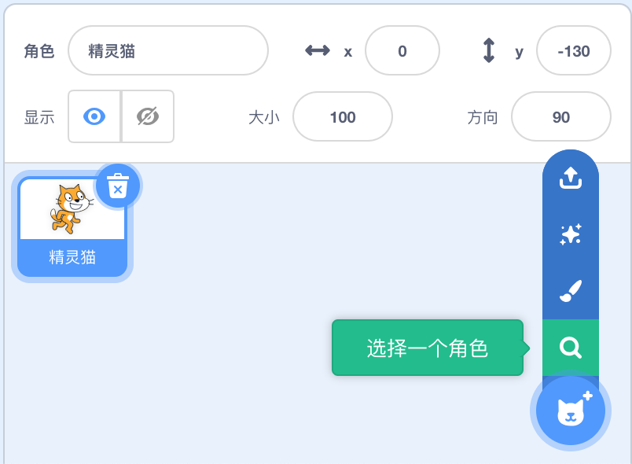

在舞台下方找到“选择一个角色”按钮，点击后进入系统内置的角色选择界面，如下：

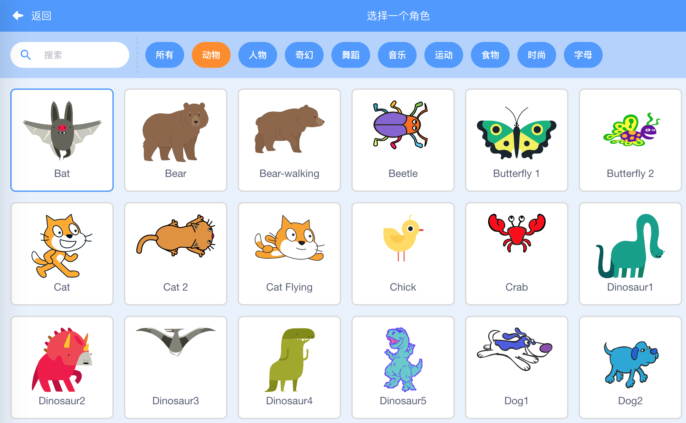

在动物标签下面，可以找到那只期待出场已久的蝙蝠。下面是添加了蝙蝠侠角色后的舞台：

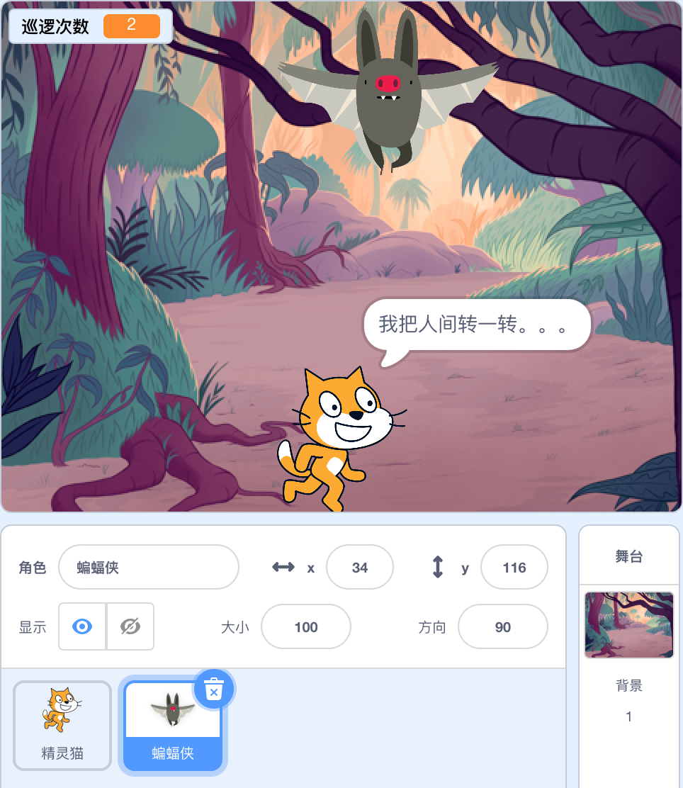

接下来就是对蝙蝠侠这个角色进行编程了。

一开始，当点击运行按钮时，蝙蝠侠要先隐身，等待精灵猫巡逻到第二圈时才现身。（以下指令针对蝙蝠侠）

那么蝙蝠侠什么时候现身呢？这应该是个自动的过程，而不需要人为的干预。那么就引入了“消息”的概念，所谓消息，就是一个通知。比如老师告诉你该做数学课本上第10页第3题了，你接收到老师这个通知后，就开始做数学作业。这就是一个消息的传递过程。

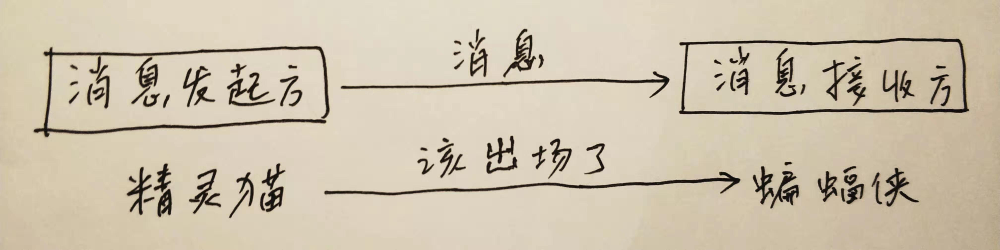

既然需要精灵猫来通过消息通知蝙蝠侠出场，那么，就需要对精灵猫的编程过程进行改进。如下，当精灵猫巡逻到第二圈时增加了一条广播指令，其中的“蝙蝠侠出场”就是自定义的一个消息。（以下指令针对精灵猫）

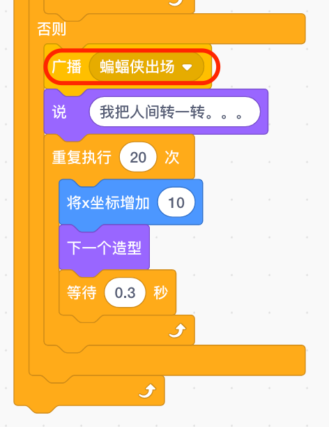

对应地，在蝙蝠侠这边，需要接收这个消息，并做一些动作。（以下指令针对蝙蝠侠）

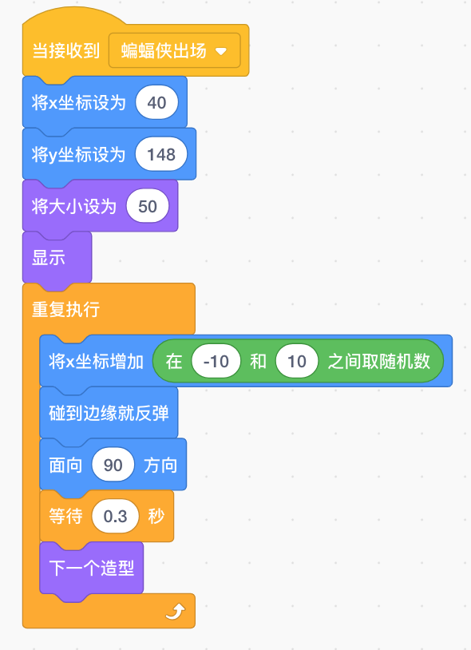

蝙蝠侠接收到要出场的消息后，首先设定一个初始位置，并且把大小设定为50%（之所以缩小比例，是为了营造由远及近的效果，看到后面会明白），然后显示。下面一段重复执行的指令，是让蝙蝠侠持续地处于飞行的状态中，而且左右摇摆。

这还不够，当蝙蝠侠出场后，在原地左右飞行个几秒钟，就要开始由远及近地飞到精灵猫附近，两位大神开始交锋。下面是接收到“蝙蝠侠出场”消息后另外一套指令，目的就是让蝙蝠侠完成上述的动作。（以下指令针对蝙蝠侠）

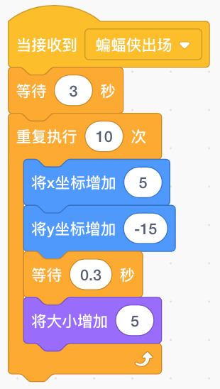

好，现在蝙蝠侠已经出场。狭路相逢，快意恩仇，一场大战一触即发。

精灵猫首先发难，喵的一声，先声夺人，向蝙蝠侠宣战。红色框中的指令是在原先基础上新增的。（以下指令针对精灵猫）

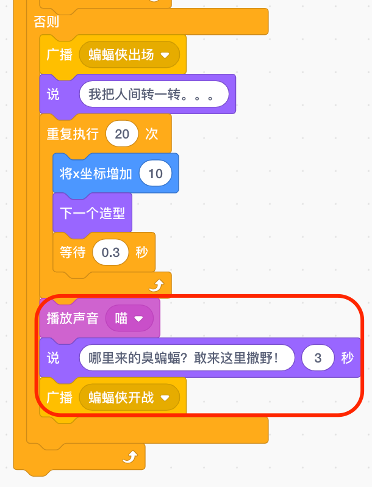

蝙蝠侠怎肯示弱，嗷的一声的接受宣战，开始了第一回合。（以下指令针对蝙蝠侠）

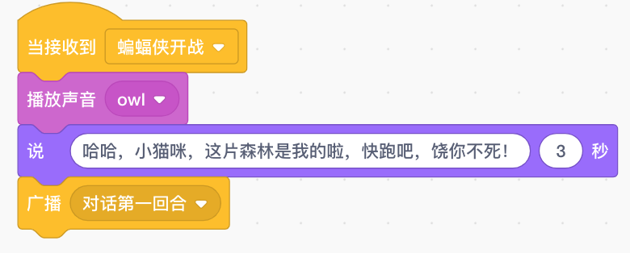

精灵猫一看不是善茬啊，一出手就是狠招啊。（以下指令针对精灵猫）

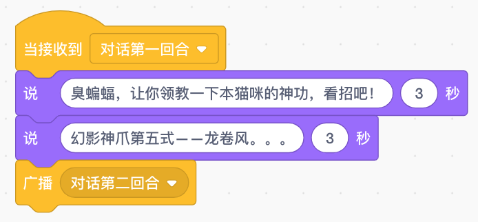

你有神功，我有绝技，你来我往这就战上了。（以下指令针对蝙蝠侠）

看来不使出点绝招，你还把我当病猫啊。（以下指令针对精灵猫）

精灵猫使出绝杀技，蝙蝠侠终于不敌，仓皇败走。（以下指令针对蝙蝠侠）

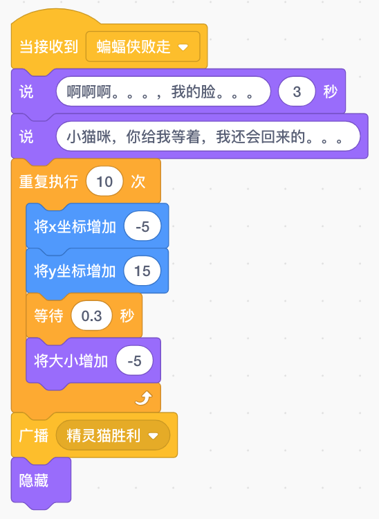

精灵猫我得意地笑我得意地笑，再来一个胜利宣言。（以下指令针对精灵猫）

最后，小导演用清脆的声音宣布剧本杀青，并用赞许的目光看了她老爸一眼，以资鼓励，我心里这个热烘烘的啊。
看下最终的视频效果：

([观看视频请移步到公众号](https://mp.weixin.qq.com/s?__biz=MzIyMTM5NDU0NA==&mid=2247483798&idx=1&sn=2eb84b7bbe156a18f084a78b32980759&chksm=e83c2289df4bab9fdaa30bbacc98526e0cf861927026c28435bd95309ea5f442bf11341f3479&token=282001194&lang=zh_CN#rd))

对我女儿第一次的编程启蒙落下帷幕了。后面会不会还有？我相信会的。不折腾折腾她，我怎么能善罢甘休呢？况且我不折腾她，她反过来就会折腾我，不如先发制人。

（完）
