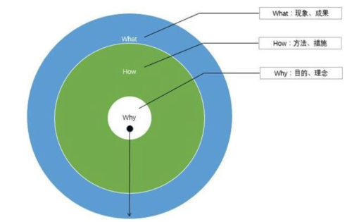

作为一名家长，如果家里面有一个小学生，就会明白辅导作业到底意味着什么。

记得以前看到过一个报道，说是南京总医院接诊一位33岁年轻妈妈，因陪孩子写作业气到脑梗，随后引起大量同病相怜家长的共鸣，纷纷吐槽自己辅导孩子写作业时的悲惨遭遇。

没有孩子的人看到这样的报道，会觉得可笑，诧异于这些家长脆弱的小心脏。竟然因为辅导作业心梗住院，真是不可思议！

但作为一个小学生的家长，我的确领教过辅导孩子作业的杀伤力，有时候真是憋到内伤。我们家就经常因为辅导孩子作业搞的鸡飞狗跳、狼烟四起。

每次看到我爱人对着可怜巴巴的女儿河东狮吼的模样，我心里就一阵发紧，为孩子打抱不平。

然而，很多事情，作为旁观者往往可以保持冷静，一旦亲自上阵、深陷其中，就会身不由己、情绪失控。有几次辅导孩子作业的过程中，我也忍不住火往上冒，心里一直念叨这是亲闺女啊这是亲闺女才忍住没有发作。

经历过几次这样的情绪波动之后，我就开始反思：为什么辅导作业这么难？我们家长在其中到底扮演什么角色？当我们辅导孩子作业时，到底在辅导什么？

回想一下我们家之前是怎么辅导孩子作业的，大致是这么个流程：

1. 各科老师在临放学前把作业布置下去，让课代表抄到黑板上，同时会发到家长群里，让家长们看到。

2. 女儿放学后，随便玩一会，开始写作业。之后趁着吃晚饭再玩一会儿，直到我们催促她做作业。

3. 写作业的过程中，女儿遇到有疑问或不会的题目，就立刻找我们问。跟她讨论几分钟到十几分钟不等，她回去接着写。

4. 写作业的过程中，女儿有拖延的现象，拿点什么小东西就开始玩。这是最令我爱人看不惯的地方，她看到这种情况就会进入抓狂模式，能忍住也是憋的够呛。

5. 等女儿都做完作业，时间也比较晚了，大人跟孩子都没精神了，即使有不会的做的题目，也赶紧告诉她答案了事。草草检查，匆匆签字，结束战斗。

很显然，这里面有两个突出的问题：

1. 作业的时间管理问题。

    女儿做作业的时间安排上没有规划，随其自然，造成的问题就是拖拉严重，到最后匆匆结束，无暇对不会做的题目做细致分析。所以，需要在时间管理上做出改善。

2. 作业的质量管理问题。

    只是为了作业而作业，完成交差，家长签字。到底从作业中收获了什么？辅导作业的本质是什么？这些问题实际上没搞明白。所以，需要对做作业的本质进行思考，做出结构化改善。

针对第一个问题：如何提高做作业的时间效率？我想到两个方面的改进措施：

1. 制作作业清单。

    在做作业之前，把各科作业明确列出来，贴在女儿的书桌旁，一抬头就能看见。每做完一项作业，就在上面打钩完成。

2. 约定作业时间。

    如果能够在约定时间之前完成作业，并且质量达标，可以给与一项奖励。比如看半小时电视，玩半小时游戏，玩一局棋牌游戏等。

    根据不同的孩子灵活设置，原则上是对孩子有强吸引力的活动，足以让他们对提前完成作业产生动力，但时间上要可控，半个小时左右比较合适。

为什么要把作业列出来，贴到孩子面前？这是利用任务清单对我们大脑的暗示作用：

- 如果作业比较多，像我家孩子上三年级，有时候各科作业加起来有十几项，明确写下来，会释放他们的认知资源，专注于当下的事情。

- 做完一项，打钩完成。这是一种正向反馈机制，增强孩子的自我效能感。而且可以明确看到整体进度，增强完成作业的信心，培养时间观念。

为什么要在孩子提前完成作业时给与适当奖励？这就涉及到行为主义心理学的“正强化”和“惩罚”原理。

何谓“正强化”？简单来说，就是一个人完成事件A后，给与一个他喜欢的事物B，就会升高他继续完成事件A的概率。

相对应的，如果一个人完成事件A后，给与一个他不喜欢的事物C，就会降低他继续完成事件A的概率。这就是所谓的“惩罚”。

知道了正强化和惩罚的原理，我们来分析一下孩子做作业时的拖延现象。

孩子在作业上拖延，很大原因是家长造成的。

我们家长总是希望孩子多学习一些，除了学校布置的作业，再给孩子布置一些额外的作业。

孩子们精明的很，他们知道提前完成作业没啥好处，还得做家长布置的作业，与其这样，不如慢点写，拖到最后，就不用写家长布置的作业了。

所以，很多孩子的学习拖延症都是家长给逼出来的。我们家孩子也是如此，当我看到我爱人给女儿买的模拟试卷时，我就明白了女儿为什么会在做作业时拖延时间了。

孩子完成学校布置的作业之后，你还继续让她去做你布置的作业，实际上给与了她一个“惩罚”，自然会降低她提前完成作业的积极性和概率。

而在孩子提前完成作业之后，适当奖励一个她喜欢的活动，相当于对“提前完成作业”这件事进行了正强化，自然会增加她提前完成作业的积极性和概率。

针对第二个问题：如何让做作业最大程度地发挥学习效果？这是一个核心的问题，值得好好研究一番。

可以利用WHY模型（也叫黄金思维圈）来帮助我们梳理一下，由浅入深地分析清楚“辅导作业”这件事的不同层次：

- What（是什么？）：分析辅导作业的现象和结果层面。

    辅导作业是家长参与孩子学习过程的一种途径，帮助孩子提高学习能力，让孩子更快更好地完成作业，在考试中取得优异的成绩，最终获得老师和家长的肯定和夸奖，增强孩子的自我效能感。

    这是理想的结果。如果我们辅导孩子作业没有达到应有的效果，甚至出现相反的结果，就要反思我们是怎么做的了。

- How（怎么做？）：分析辅导作业的方法和措施层面。

    我们在辅导作业的过程中是怎么做的？采用了哪些措施和方法？我们是否采用了正确的措施和方法，直接关系着目标结果的呈现。

    比如，有些家长为了尽快让孩子写完作业，或者让孩子作业得到老师的夸奖，就代为完成，呈现出虚假的表象。那就不要期望最终获得令人满意的结果了。

    如果方法和措施不能令我们满意，就要反思最核心的层面：我们为什么要辅导作业？

- Why（为什么？）：分析辅导作业的目的和理念层面。

    为什么家长要辅导作业？辅导作业的本质是什么？

    这里可以使用5Why追问法来帮助思考：

    - 问：家长为什么要辅导孩子作业？
    - 答：因为孩子有不会做的题目。
    - 问：为什么孩子有不会做的题目？
    - 答：因为新学习的知识点没有真正掌握。
    - 问：为什么没有掌握新学习的知识点？
    - 答：因为只是记住了一些概念名词，却不明白这些概念名词到底意味着什么。
    - 问：为什么只是记住这些新名词的字面意思并不能让我们理解运用它？
    - 答：因为这涉及到学习的本质——新-旧知识的联结，只有让新的知识跟我们大脑中的旧知识联结起来，才能达到内化知识的目的。孤立的信息对于我们并没有什么意义。
    - 问：如何才能让新-旧知识进行联结？
    - 答：可以考虑费曼学习法。

可见，辅导作业真正的目的是理解、内化新知识。这才是辅导作业的本质。

我们不能舍本逐末，把家长和孩子的宝贵时间花费在跟内化新知识无关的事情上，比如花大量时间在已经掌握的知识点上反复温习，这相当于做了大量无用功。

至于如何帮助孩子更好地理解内化新知识，我这里推荐了一个方法：费曼学习法。

所谓费曼学习法，简单来讲就是让孩子用自己的话把知识点讲出来，不是书本上说的，也不是老师说的，是用她自己理解的话来说的。形式上可以完全不限，举例子、讲故事、作比喻、画图都可以，只要是她能讲明白就行。

如果她讲不明白，说明还没有真正理解和内化这个知识点。就需要家长一步一步引导她，帮助她跟原有的知识进行关联，直到她能够用自己的话讲明白为止。

这个过程可能有点慢，但是效果很好，需要家长付出耐心。作为孩子，家长如此真诚虚心地听她讲东西，本身就是一种极大的鼓励。作为家长，一定要真诚虚心地听孩子讲，如果你三心二意，孩子也就慢慢不愿意讲了。

最后，我把我们家辅导孩子作业的最新流程贴一下，以作参考：

1. 用几分钟时间跟孩子一起把所有科目的作业列出来，贴到孩子的书桌旁。

2. 跟孩子约定好时间，比如晚上8点之前完成作业，而且质量达标，就可以玩30分钟游戏。

3. 做作业时要区分出来三种类型的题目：会做的题；有疑问的题；不会做的题。对于会做的题目，按照平时的习惯直接完成就行了；对于有疑问的题目，在前面标记一个问号；对于不会做的题目，在前面标记一个叉号。

4. 做作业的过程中不要中断去跟家长请教问题，而是按照上面的规则打标记，然后往下做。每做完一项作业就在作业清单上打勾完成，直到把所有科目的作业都做完为止。

5. 做完作业以后，家长开始检查作业。把作业清单拿过来，一项一项对应检查。对于孩子会做的题目，只需要快速地过一遍，不要花过多的时间；对于标记有疑问或不会做的题目，家长才需要重点关注。

6. 针对有疑问和不会做的题目，找出对应的知识点，利用费曼技巧，让孩子讲给我们听。如果她讲不明白，可以翻看课本、查看笔记、让我们指导，然后接着讲，直到把这个知识点讲明白为止。

7. 回到题目上，看现在是否已经会做了。一般情况下，经过前面的步骤，她自己就可以解决问题了。如果对题目还有疑问，有可能在题干上没有审明白，可以引导她多读两遍题干；也有可能在解题思路上还不清晰，可以引导她拆解思考过程，训练她分解推理过程的习惯。

8. 所有题目处理完，家长签字。根据她做作业的整体表现（是否认真？时间把控是否合理？讲解知识点是否积极思考？）判定是否达到合格标准。如果没有达到合格标准，把判定标准和不合格的细节讲给她听，让她知道哪些地方出现问题导致没有达标；如果达到了合格标准，就要要兑现承诺，该玩游戏玩游戏，该看电视看电视，但要提醒一下时间配额，不能影响晚间休息。

这是针对我家孩子的辅导流程，不同的孩子有不同的版本，各位家长要根据自己家孩子的特点和习惯定制辅导方案。

而且这种事情，没有最好，只有更好。要遵循敏捷迭代的理念，先制定一个最小起步的框架，投入运行，然后在实践中迭代更新，不断完善这个框架。

孩子不同的年龄发展阶段，有不同的方法和策略，需要灵活处理。这就是为什么要强调做事目的和基本理念的重要性，这是根本，是基础，是制定具体方法和措施的出发点。

一个小学生和初中生，在辅导作业的方法和措施上差别很大，但底层的理念是一致的。我们只要明白了最底层的那个核心理念，上层的结构和方法都可以因地制宜、灵活变化。这才是真正掌握了教育之道。