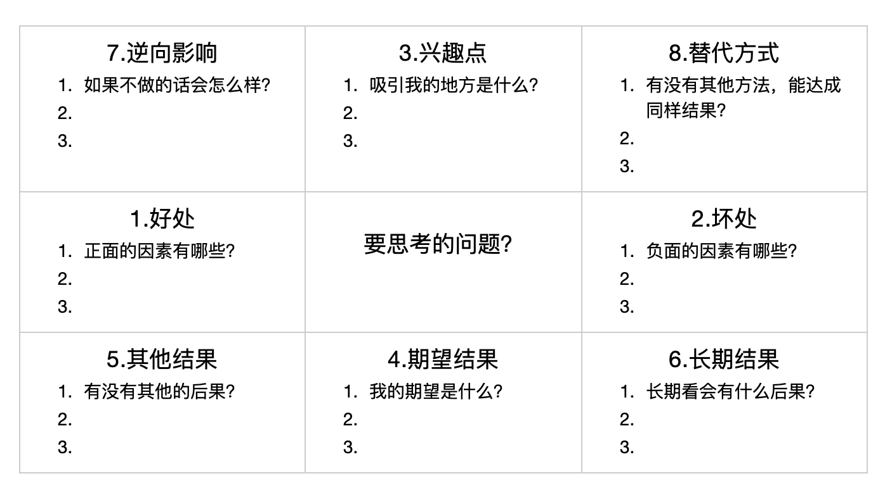
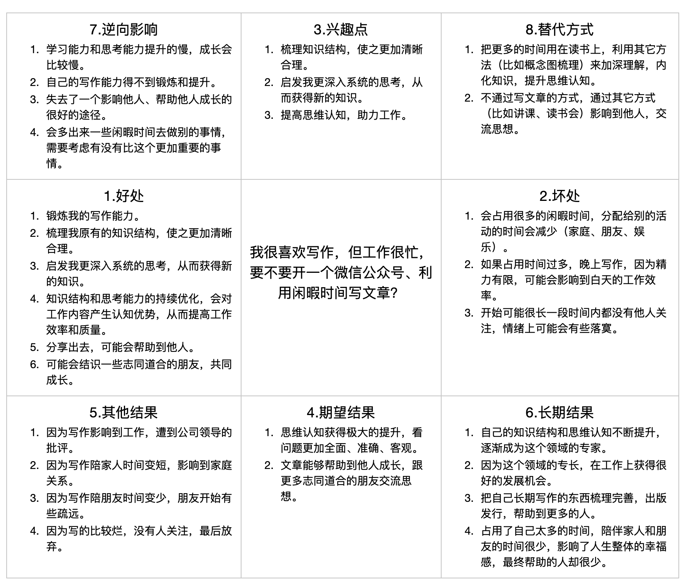

我们都知道这样一个道理：在思考重大问题时，要力求全面客观，不要凭直觉去思考和行动。

但现实情况是，我们在思考重大问题时总是失之偏颇——不够客观、考虑不周，遗漏一些重要的因素。

比如，在以下这些重大问题上，你是如何思考的？

- 我在这个城市打拼有几年了，有了一定积蓄，还租房住，那要不要用全部积蓄甚至借款去买房？

- 我现在的工作遇到了瓶颈，感觉能力欠缺，要不要去专门进修一下，然后再投入工作？

- 我很喜欢写作，但工作很忙，要不要开一个微信公众号、利用闲暇时间写文章？

- 我对目前的工作兴趣不大，要不要花点时间学习一下，转行到另外一个领域？

这样的问题我们可以列出好多。对每个人来说，各不相同，但它们有一个共同点，就是关系到我们人生的重大发展，甚至是转折，可谓是意义重大。

对于这样的问题，我们认真思考过吗？我们是怎么思考的？我们是如何保证在思考这些重要问题时能够全面客观呢？

下面我就介绍一个简单实用的帮助你思考问题的方法——曼陀罗思考法。这个方法来自于我的老师L先生，我学习实践了之后觉得非常受用，而且足够简单，掌握起来一点也不难。

下面我会分两部分来说明：

1. 框架步骤：介绍一下曼陀罗思考法的框架和步骤。

2. 应用实践：用一个实例来讲解一下如何应用这个思考法。

## 框架步骤

我们先看一幅图，这就是整个曼陀罗思考法的框架：

这是我在印象笔记中做的一个模板。你可以根据自己的使用工具偏好来定制框架模板，手绘当然也可以的。有时候在纸上画的感觉特别的好，我就经常这么做。

现在我们根据框架模板，来说明一下展开思考的步骤。

我们首先看到整体的布局是一个九宫格结构，把要思考的问题写在正中间，四周围绕这个问题有八个方面：

1. 好处：如果这样做，对我的好处有哪些？

2. 坏处：如果这样做，对我的坏处有哪些？

3. 兴趣点：在所有好处里面对我最核心、最重要的好处是什么？

4. 期望结果：如果这样做，我最终的期望结果是什么？

5. 其它结果：如果没有按照我期望的发展，它会有哪一些发展结果？通常是一些负面的、不好的、我不希望看到的结果。

6. 长期结果：我们通常只考虑短期的结果，而忽视长期的结果。这里就是站在长远的视角去估算未来的结果，五年？十年？或更长时间？

7. 逆向影响：如果不这样做，会有哪些风险？会有哪些机会？

8. 替代方式：如果不这样做，有没有其它的方法，能达到同样的结果？这里更强调思维的发散性和创新性，站在更高的维度去审视这个问题：是不是真的重要？背后的核心需求是什么？这个问题有没有切中核心需求？有没有别的方法去满足这个核心需求呢？

这八个方面，刚好按照顺序依次展开，围绕中间的问题切换不同的视角，全方位进行剖析。我们看看这个过程中都有哪些视角的转换：

- 从正面因素到负面因素的视角转换：第1步 —> 第2步。

- 从“问题”到“我”的视角转换：第1、2步 —> 第3、4步。

- 从正面结果到负面结果的视角转换：第4步 —> 第5步。

- 从短期结果到长期结果的视角转换：第4、5步 —> 第6步。

- 从“做”到“不做”的视角转换：第4、5、6步 —> 第7、8步。

可见，这里面涉及到“问题”的视角、“我”的视角、“正反面”的视角、“做不做”的视角、“长短期”的视角。正是包含了这么多的视角转换，才能够保证对问题的分析足够的全面客观、不留死角。

理论的部分就介绍完了，下面我以一个实际的问题来实践一下曼陀罗思考法。

## 应用实践

我选择这样一个问题：“我很喜欢写作，但工作很忙，要不要开一个微信公众号、利用闲暇时间写文章？”

下面是我分析的结果：

这样分析完成之后，我是否就找到答案了呢？

当然。因为答案就在我心中！

虽然会牺牲一些闲暇时间，我仍然会选择写公众号文章，因为相对于失去的，获得的更有价值。这个目标是对的，我要做的只是在前往目标的路途中根据实际情况及时调整，比如怎么做到工作、生活跟写作的平衡？怎么让家人和朋友理解我做的事情，并予以支持？怎么提高写作的效率，让这部分占用的时间尽可能缩短？这都是技术细节的调整问题，不会影响到目标的设定。

其实，很多问题，在我们分析之前已经有了答案，它就隐藏在我们的心中，只是说不清楚。曼陀罗思考法就是帮助我们引出这个答案的，让它由不可名状的潜意识中浮现出来，进入意识层面——具体化，清晰化，条理化。

所以说，曼陀罗思考法不是万能的，它必定适用于某种场景——这些问题已经在我的潜意识中思考很久了，只不过在我的意识层面还没有清晰地梳理过而已。

如果我心中没有答案，通过曼陀罗思考法仍然找不到答案。但没有关系，这很正常，把它重新扔回潜意识的暗流中，继续发酵。当有一天它发酵成熟了，再把它拎出来，答案就在我的眼前。 