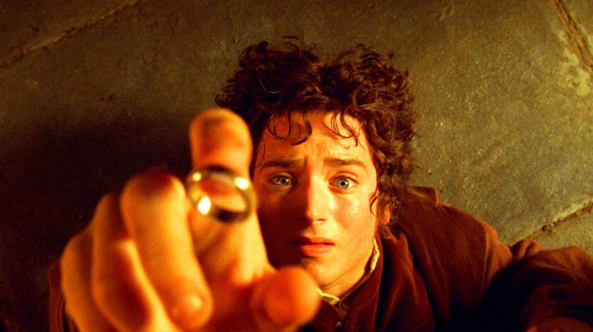

## 每个人心中都有一枚魔戒

指环王就是我们人生的一个隐喻。

魔戒就是我们每个人心中无尽的欲望。

这个欲望可能是权利，可能是金钱，可能是名利，可以是一起我们渴望得到的东西。

它可以是物质上的欲望，也可以是精神上的欲望。

为了这个欲望，我们可以神魂颠倒，可以丧失理智，可以戕害同类。

佛罗多他们踏上的艰难旅程，就是人类摒弃自身欲望、战胜心魔的过程。

佛罗多代表了纯真的自我。他意识到欲望会破坏掉内心的纯真，心甘情愿丢掉欲望的桎梏，获得真正的自由。

甘道夫代表了智慧的自我。他知道欲望的可怕，绝不敢触碰半分，并引导纯真自我走上摆脱欲望、修炼提升之路。

而其它人像阿拉贡、博罗米尔等则代表了真实的自我。他们有追求，有梦想，有热血，有抱负，但同时也有弱点，有消沉，有迷离，有可能被欲望所引诱。当他们看见魔戒时，理智上希望远离，本能上又希望靠近。他们在理智与欲望之间冲突较量，大多数时候理智占了上风，但欲望也有得逞的时机。这是我们大多数人的人生隐喻。

佛罗多他们一行人在前往末日山脉销毁魔戒的途中，遭遇了各种艰难险阻——戒灵人的围追堵截、半兽人的追杀、炎魔的BOSS暴击，这些都预示着去除欲望的过程有多难。

中国古代的理学家们提出“存天理，去人欲”的思想——人心本来纯净无私，只是被物欲遮蔽。所以要事事物物上存天理，无时无刻间去人欲，一旦松懈就前功尽弃，足见其过程之艰巨。

希望佛罗多找到他真正的自由。我们也一样。

## 灰袍巫师到白袍巫师之路

一开始，甘道夫还是一位灰袍巫师，力量还很弱小。

虽然在孩子们面前，他像一位神奇魔法师一样让天空绽放烟花，但在白袍巫师萨鲁曼面前，他却弱小得没有还手之力。

甘道夫前面还有漫长的成长之路。

但是戏剧性的一幕出现了——灰袍巫师甘道夫奇迹般地晋升为白袍巫师，浑身散发出强大而耀眼的光芒，荣耀回归。

这一切是怎么发生的？

在第一部的末尾，甘道夫跟来自远古的强大炎魔拼死搏斗，最终一起坠入深渊。

同伴们悲痛万分，因为不可能再有生还的希望了。他们永远失去了甘道夫。

然而，在第二部中，甘道夫闪耀回归，不但满血复活，还晋升为白袍巫师，实现了强力升级。

正如甘道夫所描述的他炼狱般的经历：

> 经历了烈火与深水的考验，从地心最深处到最高峰，我和魔尔斯的炎魔展开了殊死搏斗，直到我击败了他，把他的尸身丢到山下。黑暗笼罩了我，我迷失于思想和时间之外。斗转星移，每一天都像一辈子那样漫长，但这并不是结局，我终于重获新生。

灰袍巫师甘道夫经历过炼狱般的磨难之后，变身为白袍巫师甘道夫。

虽然还可以称之为“甘道夫”，但已经不是之前那个“甘道夫”了——他重获新生。

这又是指环王中一个绝妙的人生隐喻。

我们每个人的成长之路都不轻松，只有经历过千山万水，只有经历过万千磨难，我们的人生才会晋级到下一个高度。

这个晋级的过程不是一次性的，而是多次螺旋式上升的。

人生晋级之路没有终结，我们永远走在路上。

但愿我们每个人都像甘道夫那样经历炼狱，王者归来。

## 永远不要考验人性

佛罗多的人性考验之旅，实际上以失败告终。

我在前面提到，佛罗多代表了我们的纯净自我。至尊魔戒的诱惑世上少有人能够抵抗，在开始只有这个少年在魔戒面前表现出了超越常人的平静和淡然。

这让甘道夫对他给予厚望，希望这个内心纯净的少年能够完成一项艰巨的使命——前往末日火山摧毁魔戒。

但人性的复杂多变似乎超出了任何人的想象。

随着佛罗多朝着末日火山越走越近，人性的考验变得越来越残酷。

他的内心开始动摇，他的怀疑一点点滋生，他的欲望一点点膨胀。

他在清醒与迷失之间不断摇摆。

他遭受着人性中最光明和最黑暗的双重撕扯，他面临着最原始的人性欲望的考验。

过程中他一步步地走近末日火山，似乎预示着他一点点地战胜欲望，获得新生。

但现实是残酷的，在最后关头，他还是败给了强大的欲望之神，他舍弃不掉魔戒的诱惑，他向他俯首称臣。

如果连佛罗多这样的天选之子都无法完成使命，都无法通过人性的考验，试问又有谁可以呢？

如果连甘道夫这样的圣人都不敢接受这样的考验，试问又有谁可以呢？

所以，不要去考验人性！

人性并不是永恒不变的，它实际上是一个不断地摇摆和变化的过程。

现实中有太多这样的例子。你觉得自己志向高远、洁身自好，绝不会被各种欲望所撼动。你错了！那是因为你目前所处的环境太过纯净，你根本没机会被欲望所诱惑。一旦把你放在欲望的身边，你的内心防线也会一点点崩塌，就像佛罗多所经历的一样。

永远不要考验人性，它将带你到万劫不复的深渊。